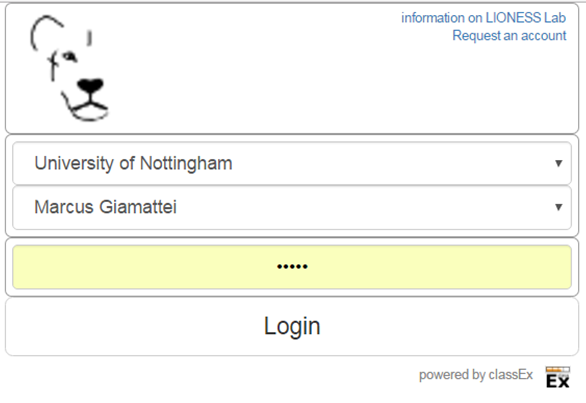
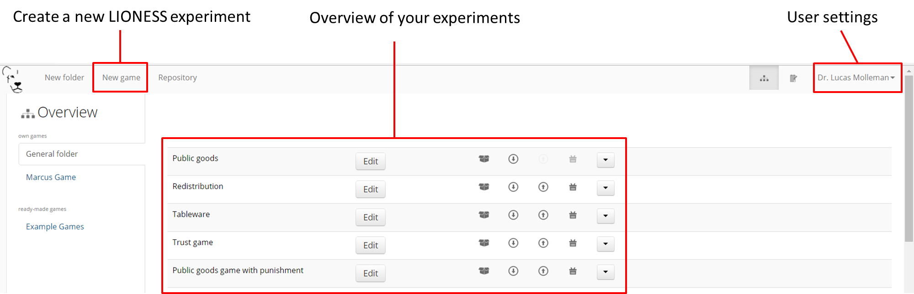
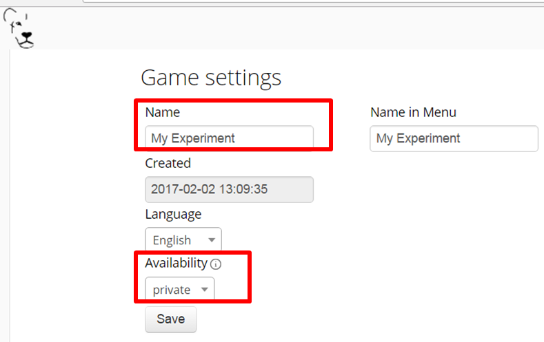
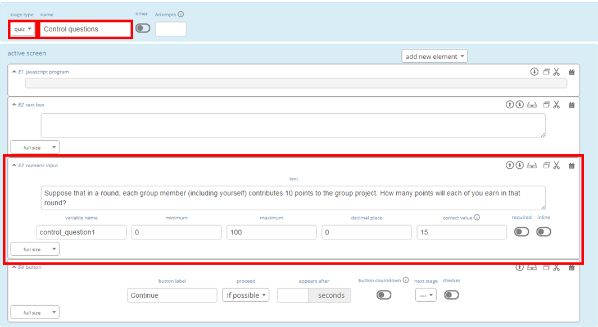
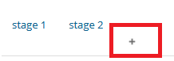
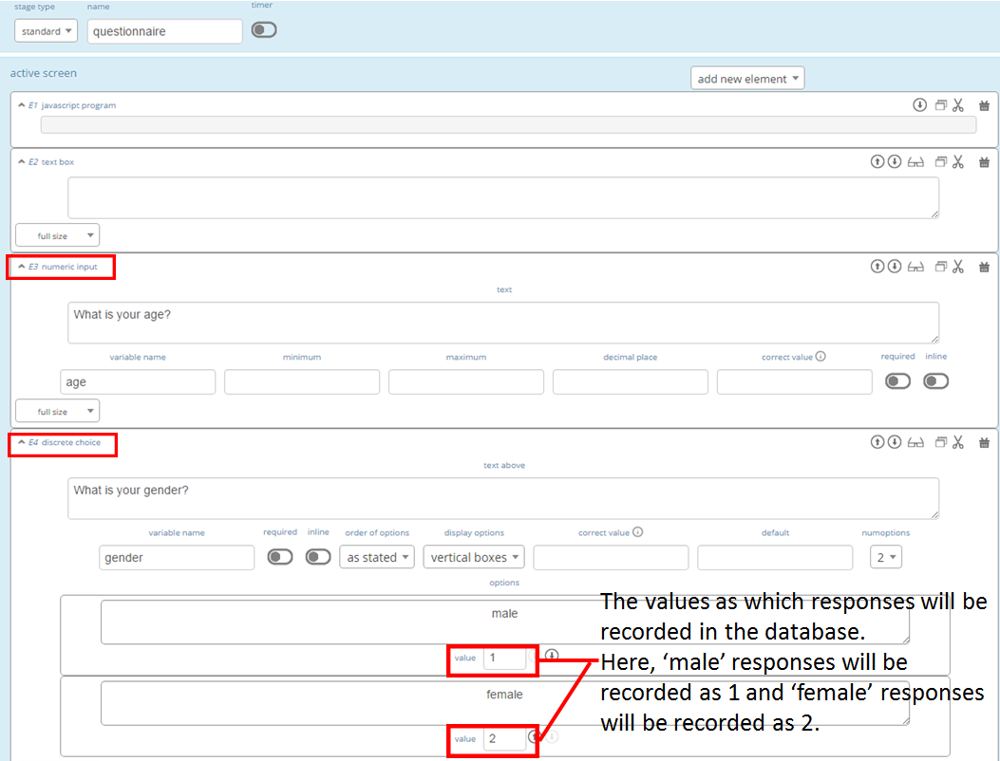

.. _basic:

===============
Get started
===============

Get access to LIONESS Lab
=========================

`Register for a LIONESS Lab account <https://lioness-lab.org/get-login-credentials/>`__ to receive an email with your credentials. On the `login page <http://lioness.uni-passau.de/classEx34/lioness.php>`__ you find your institution and your account.

Once you have logged in, the landing page allows for basic actions such as creating new LIONESS experiments, edit your existing experiments or change your user settings.

Run a demo experiment
=====================

To get a feel for LIONESS experiments, you can go to this `demo <https://lioness.uni-passau.de/bin/demo.php>`__. This will take you to the :ref:`control panel <control_panel>` of a 3-player public goods game experiment. The link will open in a new tab.
With the Control Panel you can monitor the progress of an experimental session. On the top of your screen, you can start :ref:`test players <control_panel__test_player>` to stand in the shoes participants. As you operate these test players, you can track their progress at the bottom of the Control Panel.

.. warning::  The :ref:`control panel <control_panel>` regulates the progress of participants through the experiments, so this screen always needs to be open as a session is running.

Quick tutorial: develop your first experiment
==============================================

.. note:: Expected time to complete this tutorial: 30-40 minutes.

In this section you find a quick start tutorial to familiarize with LIONESS Lab. :ref:`Later in the documentation<develop>` you can find more detailed instructions.
The steps below show you the basics of LIONESS Lab by taking you through the development a simple 3-player repeated `public goods game <https://en.wikipedia.org/wiki/Public_goods_game>`__. Box 1 shows the general setup of this experiment game. Following the steps below will make you familiar with using the basic features of LIONESS Lab. For your reference, a finished version of the experiment we will develop here can also be directly imported from the :ref:`is directly available at the example game folder <repository>`.

.. topic:: Box 1: Public goods game

    In each period of this game, each of the three participants in a group receives 10 points.
    Each group member simultaneously decides how many of these points to contribute to a *group project* (and how many to keep for themselves).
    The contributed points of all three group members will be multiplied by 1.5 and equally divided among the group members, irrespective of their contributions.
    This setup reflects a social dilemma: average payoff in a group is optimal when all group members contribute all 10 points, but it is individually optimal to contribute nothing and benefit from any contributions from the other group members.
    After making all group members have made their contribution decisions, they will be informed of the outcome of that period and a new period will start.

Create a new experiment
-----------------------

On the landing page, choose *New experiment* to define a LIONESS experiment starting from scratch. In the Experiment Settings, you can give the experiment a name, say ``Public goods game``. For now, you can set the *availability* of your experiment to *private* but you can choose to :ref:`share <share>` it with others by setting the availability to *public* later. For now we can ignore the fields on the right hand side. Click *Save* to start defining your screens.

Define screens (stages)
-----------------------

.. image:: _static/New_experiment.png
   :alt:  600px

Below the name of your experiment you can now start defining your stages as they will be displayed to participants. Two stages are pre-loaded (see screenshot above). Make sure that you select the tab named ``stage 1``. The area under the tabs shows three sections, each with a blue background. First, in the broad horizontal bar you can specify basic settings of that stage, e.g. its name, the :ref:`stage type <stage_type>` of the stage, and an optional :ref:`countdown timer <stage_and_element__countdown_timer>`. Second, in the left hand side section you can specify the :ref:`active screen <defining_your_screens__active_screen>`. In active screens you can display information to participants and record their responses. Third, in the right hand side option you can specify the :ref:`waiting screen <defining_your_screens__waiting_screen>` of that stage. In case participants need to wait for others before continuing, this will come in handy - we will get to that shortly.

Screens consist of :ref:`elements <elements>`. These can be text boxes, input fields to record numerical responses, or pieces of :ref:`javascript` to interact with the server or to do calculations. You can add elements to your screen by clicking :ref:`add new element <adding_an_element>` and select the type of element you want to add. As you will have noticed, the first stage already includes three pre-loaded (empty) elements: a :ref:`JavaScript <javascript>` field, a :ref:`text box <elements__text_box>`, and a :ref:`button <elements__button>`.

In the next steps you will define your own Public Goods Game. While defining your experimental screens, you can see how they look from the participants' perspective by compiling your experiment and starting a :ref:`test player <control_panel__test_player>` from the Control panel. For the sake of exposition, we will do this only at the end of this tutorial.

Stage 1: instructions
~~~~~~~~~~~~~~~~~~~~~

In this basic public goods game, we want the participants to read instructions first. Name this stage ``Instructions`` in the broad horizontal blue bar. In the active screen you can add instruction text by double-clicking the :ref:`text box <elements__text_box>` (second element). You can write instructions in the rich-text editor by yourself or but for now just copy in the template text from the Box 2.

Finalise your instructions stage by specifying the :ref:`button <elements__button>` at the bottom of the screen. Make sure that the next stage is Stage 2 and retain the default options for the button (so that participants can proceed if possible). Your changes to the experiment will be automatically saved upon every mouse click.

At any time during development of your game, you can view the experimental pages as the participants will see them. To do this, simply :ref:`compile and test <compile_and_test>` your experiment and start a :ref:`test player <control_panel__test_player>`.

.. code-block:: html
      :caption: Box 2: Instructions for the public goods game

      Your task  
      At the beginning of each round, each participant receives 20 Points. You have to decide how many of the 20 Points you want to contribute to a group project. The other three members of your group make this decision at the same time. The Points you do not contribute, you keep for yourself. These Points are added to your total. 
      After all group members have made their decision, all Points contributed to the group project are added up, and this number of Points is multiplied by $multiplier$. The resulting number of Points is then divided equally among the group members (irrespective of how much they individually contributed to the group project).   
      <u>In summary</u>  Your income in a round =  
      The Points you keep for yourself  
      <i>plus</i> 
      The Points you receive from the group project 

Stage 2: control questions
~~~~~~~~~~~~~~~~~~~~~~~~~~

In the next stage, we will define a set of control questions to ensure that participants have understood the instructions. Click on the tab *Stage 2* and name this stage ``Control questions``. In the broad horizontal bar, set the :ref:`stage type <stage_type>` to *quiz*. In quiz stages, the LIONESS software automatically records the number of attempts by each participant to answer the control questions.

Announce the control questions in the pre-loaded text box. To add your first control question, click :ref:`add an element <adding_an_element>` and choose :ref:`numeric input <numeric_input>` from the drop-down list. Small :ref:`paste <adding_an_element>` icons will appear between each of the elements in the screen. Click on the icon right under the text box to add the numeric input element. Once this element is added to the screen you can write the question in the *text* field of the element. In this case, write ``Suppose that in a round, each group member (including yourself) contributes 10 points to the group project. How many points will each of you earn in that round?``.

Add a variable name, say ``control_question1``. Specify the range of numbers that participants may enter. In this case you can set the *minimum* to 0 and the *maximum* to 100. Set the *decimal place* to *0* such that the participants' screen will only accept integers as a response to this question. By clicking the *required* switch you can make sure that participants require to give a response to an element. Set the field *correct value* to 15.

Finally, add a button to the screen by clicking *add new element* and select the :ref:`button <elements__button>`. Add it to the bottom of the screen by clicking the paste icon right below the *numeric input* field you just created. Keep the defaults for now.

Stage 3: lobby
~~~~~~~~~~~~~~

The next stage will be a :ref:`lobby <lobby>` in which participants wait to be :ref:`grouped <matching_procedures>` with others. In this case we will form a group as soon as three participants have completed the control questions and are ready to start the interaction phase of the experiment. Add a new stage to your experiment by clicking the *+* sign in the tab next to Stage 2 (see below). A new Stage tab will appear. In the horizontal blue bar, set its stage type to :ref:`lobby <lobby>` and name the stage ``Lobby``.

Set the timer to 300 seconds and delete the *button* (we do not need a button in the lobby). When participants are still waiting to be :ref:`matched <matching_procedures>` with others after this time has passed, they will automatically get the choice to either return to the lobby and wait for two more minutes, or to proceed to another stage (defined in the *leave to* field, we will get to that later). In the active screen, the default text in the lobby reads ``Wait for the other members of your group to complete the control questions.`` For now we do not need to define anything here. We do not need any buttons in this screen. The software will forward the participants as soon as a group has been formed.

Stage 4: decision
~~~~~~~~~~~~~~~~~

Once three participants are in the :ref:`lobby <lobby>`, they will be :ref:`matched <matching_procedures>` and will be directed to the decision screen. In the Decision stage, participants will be asked to choose their contribution to the group project. First, add a new stage to your experiment with the *+* sign. In the new stage, set the name to ``decision``. To indicate in which period participants currently are, we require the variables :ref:`period <standard_variables>` and :ref:`numberPeriods <standard_variables>`. These two are among the :ref:`standard_variables <standard_variables>` that are automatically loaded in the JavaScript of each stage. In the text box you can display JavaScript variables by using dollar signs around their names. Here you can write: ``Round $period$ of $numberPeriods$``.

To add the field in which the participants can enter their contributions, click :ref:`add new element <adding_an_element>`, choose :ref:`numeric input <numeric_input>` and paste this element below the text box you just defined. In the *text* field of this element, you can write: ``You received 10 points to start with. How many points (0-10) do you want to contribute to the group project?``. Set the variable name to *contribution*, set the minimum to 0, the maximum to 10 and the decimals to 0. Switch on the *required* option to ensure that all participants make a decision, which will be stored in the *decisions table* of this experiment's :ref:`database <experiment_tables__decisions>`. Finally, in the button at the bottom of the screen, specify *proceed* as *wait for others*. This will ensure that the participants will only be able to continue to the next stage when all group members are ready. Participants will wait for others in the :ref:`waiting screen<defining_your_screens__waiting_screen>` on the right hand side section. When nothing is defined in the waiting screen, a default waiting text will be shown. For now we can leave the waiting screen undefined.

Stage 5: results
~~~~~~~~~~~~~~~~

Once all participants in a group have made their decisions, they will be shown the outcome of that period. First, again, add a new stage to your experiment with the *+* sign. Name this new stage *results*. To calculate the outcome of this period of the public goods game, we need to get the decisions of the others from the database. LIONESS Lab provides a set of :ref:`JavaScript functions <javascript>` to do this in a simple way. In the Javascript element, you can copy the code from Box 3.

Note that JavaScript code will be executed in the browsers of the participants, so any JavaScript code should be written from the perspective of the participant.

The key functions we use here are ``getValue()`` and ``getValues()``. In this case, ``getValue('contribution')`` will return the value of *contribution* in the :ref:`database <experiment_tables__decisions>` from the current participant from the current period. Likewise, ``getValues('contribution')`` will return an array with the contributions of all group members in the current period. With ``record()`` you can write a variable from Javascript to the database. In this case we will store for each round the total earnings of each player.

To display the calculated variables, again use the dollar signs around the variables names in the text box.

The Results stage is the second and last stage of a period. To define the correct *routing* of the participants through your experiment, you should specify which of the stages comprise a period which will be repeated. Technically, this means that the program will *loop* through these periods for a number of times. You can do this in the :ref:`parameters table <parameters>`. You can find this at the horizontal grey bar at the top of your screen. Here you can specify the basic parameters underlying your experiment. To specify the beginning and end of the periods in your experiment, set loopStart to *Decision* and loopEnd to *Results*. Now you are editing the parameters table, you can also set the number of periods (numberPeriods) to 5. By clicking the *Back* button at the top you return to the page in which you define your experiment. You are almost done specifying your experiment.

For now you can leave the *next stage* field of the button empty.

.. code-block:: javascript
   :caption: Box 3: JS code for public goods logic
   :linenos:

   // specify the initial endowment
   endowment = 10;  
   // retrieve data
   myContribution = getValue('contribution');
   keptForSelf = endowment - myContribution;
   allContributions = getValues('contribution');
   // apply public goods logic
   sum = 0;
   for (var i=0; i<allContributions.length; i++){
        sum += allContributions[i];
   }
   averageContribution = sum / currentGroupSize;
   product = 1.5 * sum;
   share = product / currentGroupSize;
   earningsThisPeriod = keptForSelf + share;
   record('payoff', earningsThisPeriod);

.. code-block:: html
   :caption: Box 4: Results text
   :linenos:

   Round $period$ of $numberPeriods$: Results

   Your contribution to the group project: $myContribution$.
   Average contribution in your group: $averageContribution$.
   Sum of contributions in your group: $sum$.
   This amount is multiplied by 1.5, yielding $product$.
   Each group member receives an equal share: $share$.

   Your earnings

   Points kept for yourself: $keptForSelf$.
   Your share from the group project: $share$.
   Your total earnings in this round: $earningsThisPeriod$.

Stage 6: questionnaire
~~~~~~~~~~~~~~~~~~~~~~

Once the decision making part of the experiment is over, you might want to add a questionnaire stage. Add a new stage, again by clicking the *+* sign in the rightmost tab. Add a new :ref:`numeric input <numeric_input>` for the question ``What is your age?``. For these numeric inputs you need to define a range of allowed values. Then, add a :ref:`discret choice <discrete_choice>` for the question ``What is your gender?``. For the numeric element for the age you should now be able to define it. For the discrete choice, you can specify the question in the *text* field. At the bottom of this element you can define the text inside each of the choice options that the participants will choose from. In the *value* field of each choice option you have to specify the value as it will be recorded in the database (which, for this element type, stores the responses as numbers). Ensure that the :ref:`button <elements__button>` allows participants to proceed if possible.

Stage 7: final earnings
~~~~~~~~~~~~~~~~~~~~~~~

You have arrived at defining the final stage of the experiment. Add a new stage with the *+* sign. On this page you will sum the earnings of each participant and display it on their screen. To do this, we will sum the participant's earnings across all rounds. In the text box you can write the total earnings (in experimental points and real currency) to the participants' screen. Note the variable *exchangeRate*, which is defined in the
:ref:`parameters <parameters>`.

.. code-block:: javascript
      :caption: Box 5: JS code for calculating total earnings
      :linenos:

      totalPoints = 0;
      for (var i = 1;i <= numberPeriods; i++){
         payThisPeriod =
            getValue('decisions', 'playerNr='+playerNr+' and period='+i, 'payoff');
         totalPoints += payThisPeriod;
      }
      valuePoints = totalPoints * exchangeRate;

.. code-block:: html
      :caption: Box 6: Final earnings text
      :linenos:

      Your final earnings are: $totalPoints$.
      These points are worth: $valuePoints$.

Set parameters
--------------

Before we start testing, we need to set the parameters. You can do so by clicking *parameters* in the top horizontal menu. In the :ref:`parameter table <parameters>` we will define where a period starts, and where it ends. In the :ref:`predefined parameters table <parameters__predefined_parameters>` tab you can set the parameters :ref:`loopStart <parameters__loopstart>`  to *Decision* and :ref:`loopEnd <parameters__loopend>` to *Results* by using the drop-down menus. This means that at the end of a period, and when a new period starts, groups will move from the Results stage to Decision stage. Once the period number reaches :ref:`numberPeriods <standard_variables>`, participants will proceed to Questionnaire (the stage defined right after Results).

Compile and test
----------------

Your experiment is now ready for testing. In the horizontal bar on the top of your screen, click :ref:`compile and test <compile_and_test>`. LIONESS Lab will compile your experiment and will open the :ref:`control panel <control_panel>` of your experiment in a new tab.

Control panel
--------------

In the :ref:`control panel <control_panel>`, you can start testing your experiment by switching on the :ref:`test mode <control_panel__test_mode>` and start a :ref:`test players <control_panel__test_player>`. A new tab will open with the experimental pages you defined - this allows you to see how the pages you defined will be displayed to participants. If needed, you can start a second test player (e.g. to play in a group after being matched in the :ref:`lobby <lobby>`).
