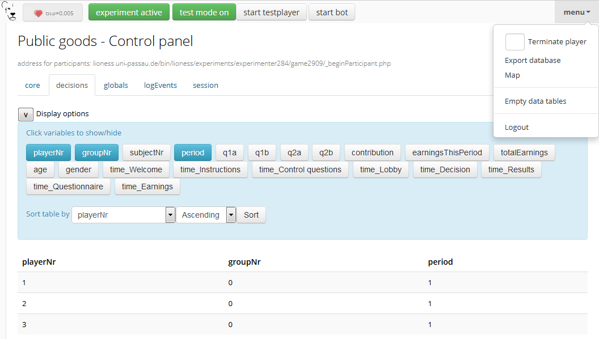
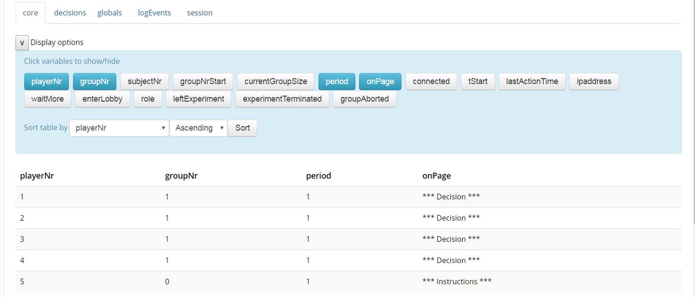

=========================
Conceptual overview
=========================

.. _architecture:

Architecture
=============

LIONESS experiments regulate the information flow between participants. Before a session, the experimenter uploads the LIONESS experiment to the
server. In a typical online experiment participants log in to the server via a link posted on a crowd-sourcing website (e.g. `Amazon Mechanical
Turk <http://www.mturk.com>`__). Participants interact through their web browsers and receive a code to collect their payment upon completion.
Throughout the session, the :ref:`control panel <control_panel>` displays the participants' progress in the experiment.

.. image:: _static/Technicalflow.png
   :alt:  600px

Standardized methods
--------------------

LIONESS experiments provide a set of standarized methods for group formation, attrition and other challenges of interactive online experiments. This is extensively discussed in a `this <https://link.springer.com/article/10.1007/s10683-017-9527-2>`__ paper by Arechar et al.

.. _control_panel:

Control panel
-------------

The :ref:`control panel <control_panel>` allows the experimenter to control the experimental flow (start and stop the experiment), observe the data collection and download the data and payment file. The control panel also triggers the :ref:`central controller algorithm <control_panel__controller_algorithm>`.

During a session, the control panel of the experiment needs to be open on the experimenter's computer.

.. _control_panel__global_control:

Global control
~~~~~~~~~~~~~~

The horizontal top bar contain basic control functions.

.. image:: _static/Control_panel_1.png
   :alt:  800px

.. _control_panel__controller_algorithm:

Controller algorithm
~~~~~~~~~~~~~~~~~~~~~~

The controller algorithm is called by the control panel page. Each second, the control panel will run a PHP script on the server performing checks related to the flow of the experiment. Specifically, the controller algorithm:

- Registers new participants. It checks whether they have not entered the session before. If a participant has not entered before, the controller algorithm assigns them a unique player number (*playerNr*). If the button *Game active* is switched off, no participants are allowed to enter a session, but those that are in will still be able to proceed.
- Regulates grouping. It tracks the number of participants waiting in the lobby, and groups together those that are ready. Various pre-programmed :ref:`grouping procedures <lobby>` are available.
- Regulates group progress. It tracks for each group the number of participants that are ready to proceed to the next period (or a next stage, in case the experiment requires participants to wait for their fellow group mates) and controls their proceeding to the next period
- Handles dropouts. In case a participant has dropped out (that is, the server cannot detect that their are active), the controller algorithm can take action. Upon dropout, you can choose to have the group continue with reduced size, terminate the whole group, or to take no action at all. You can define your :ref:`dropout handling <parameters__dropouthandling>` preferences in the :ref:`parameters table <parameters>` of an experiment.

Global settings
~~~~~~~~~~~~~~~

.. _control_panel__active_inactive:

Game active / inactive
^^^^^^^^^^^^^^^^^^^^^^

With the 'Game (in)active' button, you can block new participants from entering. They will be directed to a page that they cannot participate at this time. You can customize the default text shown in these cases in the experiment's :ref:`parameters table <parameters>`.

.. _control_panel__test_mode:

Test mode
^^^^^^^^^

When developing your experiment, it is often useful to test you experiment by playing as a participant and inspecting the screens. The test mode will allow you to enter multiple times (i.e. control multiple *participants*) from the same browser. Once click this button, two more buttons will appear that will allow you to start your experiment as a test player or start a :ref:`bot <bots>` , which will make automated decisions. The bot is useful for experiments in groups (so you have to control only one test player while the other decisions are generated automatically), or for long experiments (in case you want to check whether all data is correctly recorded in the database).

.. _control_panel__terminate_player:

Terminate player
~~~~~~~~~~~~~~~~

You can manually remove a participant from a session by entering their value of *playerNr* in the field next to *Terminate player*. This will take that participant to a screen indicating that they can no longer proceed. The software will treat this participant as a *dropout*, that is, the group will proceed according to the :ref:`dropout handling <parameters__dropouthandling>` settings. Note that terminating a participant is a *last resort* measure.

Export database
~~~~~~~~~~~~~~~

With this button the database of the experiment is exported as an Excel file. Each of the :ref:`experiment tables <experiment_tables>` will be shown in a separate Excel tab.

Empty data tables
~~~~~~~~~~~~~~~~~

With this button you can empty the tables of the experiment's database. This will not emtpy the :ref:`experiment tables <experiment_tables__globals>` will not be emptied.

Map
~~~

By clicking this button, an external program will create a map showing the location of the participants of your session. These locations are based on the logged IP addresses.

Logout
~~~~~~

Log out of the experiment.

.. _control_panel__monitor:

Monitor
~~~~~~~~~~~~~~

The bottom section allows you to monitor of a session and track the participants' progress. You can browse the :ref:`tables <experiment_tables>`  underlying the experiment by clicking on the different tabs.

During a session, basic information about the entered participants will appear in the *core* table. By clicking the *display options* button, you can choose which variables in this table you want to track. Clicking the buttons with the variable names will make them visible in the page section below. This section will be updated every second. Among the most useful variables are: playerNr, groupNr, period and onPage. The *onPage* variable tracks which page a participant is currently watching. These pages are marked with stars (indicating :ref:`defining_your_screens__active_screen`) or dashes (indicating :ref:`defining_your_screens__waiting_screen`).

In the example above, there are 5 participants in the experiment. Participants 1-4 have just passed the lobby and have been grouped together - the value of groupNr is *1* for each of these participants. They are currently in period 1, on the page *Decision*. Participant 5 is currently on a page called *Instructions* (which in this case comes before the lobby).

Download data and payment files
~~~~~~~~~~~~~~~~~~~~~~~~~~~~~~~~~

TBA

IP-based location map
~~~~~~~~~~~~~~~~~~~~~~

TBA

.. _experiment_tables:

Experiment tables
-----------------

.. _experiment_tables__core:

core
~~~~

The variables in this table form the core of the experiment. These variables regulate the flow of the experiment, and are used by the controller algorithm to detect progress. This table is the most useful table to monitor during an experimental session.

.. _experiment_tables__decisions:

decisions
~~~~~~~~~~~~

This table stores the data that is generated by the participants. All their responses are stored in this table. For each period, for each participant, one row will be added to this table to store any responses generated in that period.

.. _experiment_tables__globals:

globals
~~~~~~~~

This table stores the parameters of the session. These can be manipulated in LIONESS Lab, in the :ref:`parameter tables <Parameters>` of an experiment. In addition, this table contains the :ref:`message texts <parameters__messages>` displayed to participants once they have dropped out of a session, or cannot participate for some reason.

.. _experiment_tables__logevents:

logEvents
~~~~~~~~~~

This table documents key events during the experiment, such as participant entry and dropout. Entries are added by the :ref:`controller algorithm <control_panel__controller_algorithm>`.

.. _experiment_tables__session:

session
~~~~~~~~

This table contains session data. Each participant is associated with one row in this table.

Terminology
=========================

Experiment and Session
-----------------------

Stage and Element
-----------------

.. _stage_and_element__countdown_timer:

Countdown timer
~~~~~~~~~~~~~~~
In interactive tasks, it is often useful to set timers on decisions to keep up the pace of the experiment. Countdown timers prompt participants to give responses within a set time, and reduces the waiting time for their group mates, which in turn reduces inattention and dropouts.

.. image:: _static/Timeoutpic.png
   :alt:  500px

To add a timer to a participant screen, click the *timer* switch on the top of the stage. Set the time (in seconds) that participants can take to submit their response. If the option *leave stage after timeout* is switched off, nothing will happen once the timer reaches 0. If this option is switched on, you are prompted to define the stage to which non-responsive participants are directed to. You can choose a stage that you defined yourself, or choose the *standard* timeout page. This page will show the participants the :ref:`message <parameters__message5>` that is specified in the :ref:`parameters table <parameters>`. You can also choose to direct non-responsive participants to the waiting screen of the current stage. In that case, make sure that the experiment can continue, e.g. by filling out a default response by the participant so that results can be calculated.

Note that in :ref:`JavaScript <elements__javascript_program>` , the number of seconds in the countdown timer can be manipulated with the variable *TimeOut*. This is useful if you want to give participants more time in early rounds. The below example illustrates this.

.. code-block:: javascript

   if (period < 3){
     TimeOut=120;
	}

Period and Loop
---------------

Player, Role and Group
----------------------

