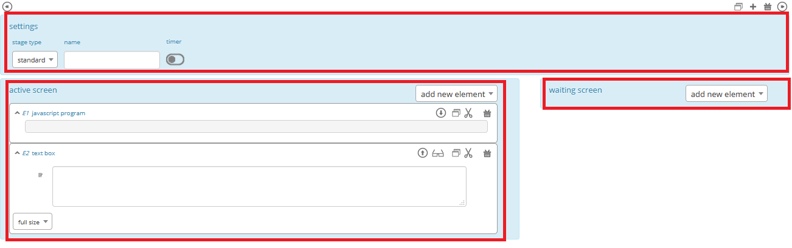

.. _develop:

=========================
Develop
=========================

There are two basic ways to develop your LIONESS experiment. You can either start from scratch, or :ref:`build on an existing experiment <build_on_an_existing_experiment>`. The :ref:`repository` contains a range of different LIONESS experiments for you to use and adjust to accommodate your requirements.

Here we describe how to develop your LIONESS experiment from scratch. We describe how to create a new game and define your screens. If you have already completed the tutorial, many of the steps described here will look familiar to you. This chapter gives a fuller description of the features that LIONESS Lab has to offer.

Create experiment
=========================

On the LIONESS Lab landing page, you can create a new LIONESS experiment by clicking *new experiment* in the :ref:`top horizontal bar <main_menu>`.

In the next screen you can define basic settings of your experiment by filling out the appropriate screens.

.. image:: _static/New_game.png
   :alt:  300px

With the drop-down menu under *availability* you can choose to keep  experiment private, or to share it with other LIONESS Lab users by making it *public*. Other users will be able to copy public experiments from the :ref:`repository <repository>`  to their LIONESS Lab accounts and edit these for their own purposes. Experiments' settings can be adjusted at any time.

With the input fields on the right you can give additional information on your experiment (e.g. you can use the comments section to list the number of sessions run with this experiment, or add any caveats you might have). This information can then be used by other LIONESS Lab users that might want to build on (parts of) your experiment.

Defining your screens
=========================

Your screens consist of three sections: *settings*, an *active screen* and a *waiting screen*.

Stage settings (top panel)
--------------------------

In the top horizontal bar, you can give the stage a name, and define its :ref:`type <stage_type>`: (:ref:`standard <stage_type__standard>`, :ref:`quiz <quiz>` or :ref:`lobby <lobby>`). Also, you can add an :ref:`optional timer <stage_and_element__countdown_timer>`.

.. _defining_your_screens__active_screen:

Active screen (left panel)
--------------------------

The active screen is the main screen of a stage. Typically, this section will be used for displaying information (e.g. instructions, results from previous periods) and recording participants' responses.

You can build up these screens step-by-step using :ref:`elements <elements>`. You can add these elements by clicking the button *add new element* and paste it in the place you want. On the participant screens, elements will in principle be placed below each other, in the order you define them in your LIONESS Lab screen.
Typically, the final element of an active screen is a :ref:`button <elements__button>`, that submits any responses of the participant in that screen, and directs them to the next screen. In this button, you can also define whether the participants can move on to the next screen as soon as they have finished, or whether they have to wait for their groups mates to also finish this screen. In the latter case, participants will be directed to the Waiting screen of this stage (see
below).

.. _defining_your_screens__waiting_screen:

Waiting screen (right panel)
----------------------------

In case you allow participants to move to the next stage only when all group members have completed the stage (by setting the *proceed* condition in the active screen :ref:`button <elements__button>` to *wait for others*), participants will be directed to the Waiting screen of the stage.

You can add :ref:`elements <elements>` to the Waiting screen in the same way as you add them to the Active screen. If you do not define any element there, the Waiting screen will show a default text indicating that participants should wait for all group mates to complete.

Setting parameters
=========================

For testing (and running) your experiment, you need to set the experiment :ref:`parameters <parameters>`. Make sure that the :ref:`loopStart <parameters__loopstart>` and :ref:`loop end <parameters__loopend>` parameters are set to the stages that mark the beginning and end of a period, respectively. The full list of parameters together with an explanation can be found :ref:`here<parameters>`.

.. _build_on_an_existing_experiment:

Build on an existing experiment
===================================

Go to the :ref:`repositiory <repository>` and import an existing experiment. Any experiment that was made public can is shared with, and can be imported by, other experimenters. After importing an experiment it will be visible in your landing page with the overview of your experiments. If you want to the imported experiment,you have to make a copy of it. To do this, click *View* next to the experiment on your landing page. In the experiment's page, you will see you cannot edit the experiment as it was created by another user. Click *experiment* in the top bar, and then *copy experiment*. An editable copy of the experiment will be created in your account.
