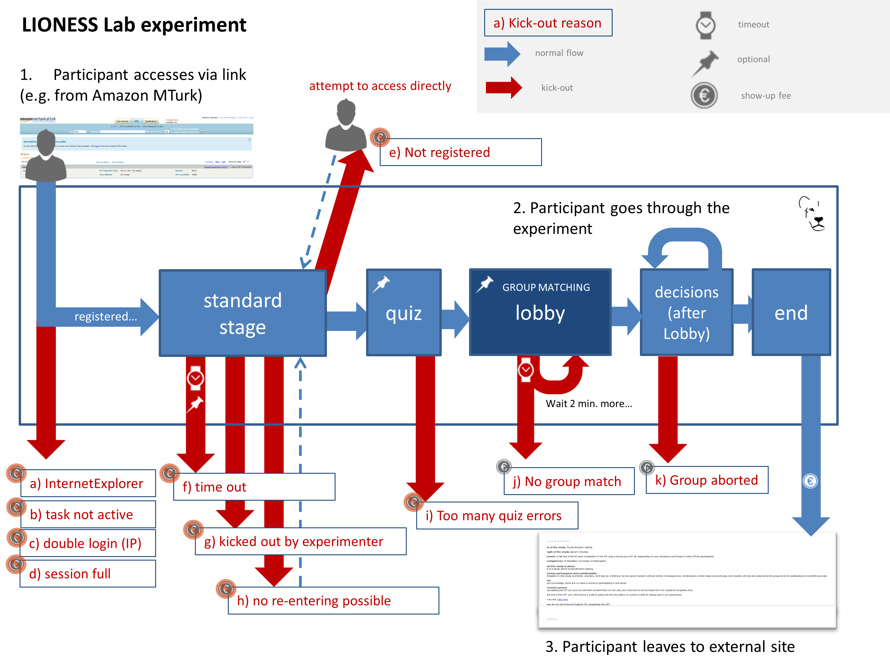

====================
LIONESS experiment
====================

In LIONESS Lab you can create LIONESS experiments. These experiments include a set of standard features enabling online interactive experiments. Here we describe these features. 

.. note:: This section provides an overview of the structure and functioning of LIONESS experiments. Implementation issues are discussed in :ref:`the develop section <develop>`.

Online experiments: challenges and solutions
===========

Conducting experiments online presents a set of methodological and logistical challenges not present in the traditional decision making laboratory. LIONESS experiments have built-in features that deal with these challenges. The most important one is <b>driving down dropouts</b>. 

In online experiments, participants may drop out. Typically they complete their experiment from home, and can get distracted (especially when waiting on others), have a bad internet connection or may just leaving a session by closing the experimental pages. This will lead to missing data. Moreover, in interactive experiments, dropouts can also affect other participants (e.g. group mates). LIONESS experiments help avoid dropouts with measures reducing waiting times. 

<b>Timers</b> can be added to decision pages, keeping up the pace of decision making in a group. Experimenters can choose to remove unresponsive participants from the experiment and let the others proceed. Furthermore, <b>groups can be formed on-the-fly</b>. Participants often do not enter experimental sessions exactly at the same time, and they will vary in the time they take to read instructions (and complete control questions). Groups can be started as soon as sufficient participants are ready to start making decisions.

Should dropouts occur, standard procedures are in place to adequately deal with that. Experimenters can choose to allow participants to complete the experiment if one (or more) of their group mates have dropped out. This prevents disappointment for participants (in case they wouldn't be able to complete the eexperiment and might earn less than they expected), and, relatedly, negative online reviews potentially damaging the experimenter's reputation.

Experimental Flow
==================

The following figure shows the flow of a typical LIONESS experiment. 

1. Participants enter the experiment via a web link from an external website (e.g. Amazon MTurk), and are registered on the server (that is, they receive a 'player number', a unique number to identify them during the experiment). 
2. They complete the experiment by navigating the pages (---LINK--->see XXX for a typical experimental design, including tips and tricks <--- LINK---). 
3. At the end they return to the external site to collect their earnings (euro sign). 

The blue arrows show the typical experimental flow. The red arrows show exceptions to the typical flow (most notably, dropouts) and the mechanisms in place that deal with those exceptions. The blue line around the experimental stages mark the boundaries of a LIONESS experiment.

When participants enther the experiment, they are registered and get a unique player number. Then they go to the first stage of the experiment (typically instructions). This is a '[---LINK ---> standard page'] <---LINK- ---] that provides information to participants. After that, an optional [LINK ---> 'quiz' <--- LINK] may follow in which participants have to answer control questions to ensure understanding. After passing the quiz, participants wait in the [LINK--->lobby<---LINK] to be matched to a group. The lobby is a key stage of an interactive experiment. It is not needed for solo tasks. Once they are matched in a group, participants make their decisions and receive feedback (possibly over several rounds). Once they completed the interactions rounds, they are informed about their payoffs.  From there they are directed back to the external site (e.g. MTurk) to collect their payment. 

While participants complete the experiment, various exceptions might happen. Below we list how LIONESS experiments handle these issues. 

.. note:: Upon dropout participants receive different standard messages, which can be customized in the paramters. For all list of all messages see also :ref:`here <040_reference_manual.html#parameters-messages>`. All messages refer to the terminology HIT which is a task on Amazon MTurk.

.. note:: LIONESS experiments do their best to prevent double participation by IP address check and cookies in the browser. Some of these measures can still be circumvented with some effort. If you want to be 100% sure that participants only participate once they should be provided with a ticket or unique ID which they have to enter during the experiment.

a) Internet Explorer
---------------------

LIONESS experiments (like many other modern web applications) do not support Internet Explorer (IE). Experimenters can announce this upon recruitment (e.g. in their MTurk HIT). In case an IE user attempts to enter the experiment, they are directed to a page explaining that they cannot participate. By default, this message reads:

.. warning:: As indicated in our HIT text on MTurk, our HIT does **not** support Microsoft Internet Explorer.                         Please return this HIT. We apologise for any inconvenience caused.

Participants can return using a different browser.

.. note:: All the default messages can be edited in the [LINK--->parameter table<---LINK].

b) Task not active
-------------------

Experimenters can set the experiment 'inactive' or 'active' in the control panel. If the task is inactive, new participants cannot enter and receive the following default message:

.. warning:: This HIT is currently offline. You cannot participate at this time.

When an experiment is switched to 'inactive' in the middle of a session (for example, when an experimenter realizes that something is wrong), participants who are already in the experiment can continue and complete the experiment.

c) Double login
----------------

LIONESS experiments record the IP addresses of participant in an <b>anyonimized</b> way to protect personal data. With the anyonimized IP addresses it can be checked if two participants log in from the same IP address. The actual IP address cannot be retrieved.

If a login attempt is made from the same IP address, the participant is blocked and receives the following message:

.. warning:: According to our records, your device has already been connected to the server during this session.                Participants are only allowed to enter a session once. Thank you for your understanding.

This IP address check is **deactivated** whent the [LINK-->test mode<---LINK] is on.

.. note:: If you think that your participants may use the same IP address (which may be common in a laboratory setup) you may switch to test mode. Otherwise participants cannot enter the experiment. 

d) Session full
----------------

In the [LINK-->experiment parameters<---], you can set the total number of players. When this number has been reached, further participants cannot enter anymore. They receive the message: 

.. warning:: We have sufficient participants for this HIT. Unfortunately, you cannot participate at this time. Thank you for your understanding.

This functionality is **deactivated** whent the [LINK-->test mode<---LINK] is on. 

.. note:: When a participant tries to enter an experiment, the current number of participants is compared to the total number of players allowed. The current participants also include those who started the experiment but dropped out (see f), g), i), j) and k)). It is therefore often useful to set the parameter [LINK--->'totalPlayers' <---LINK] higher than the number of participants you actually need.

e) Not registered
-------------------

If a participant tries to participate in a LIONESS experiment by navigating to a stage in the experiment without being registered he or she is informed about that. 

.. warning:: You are currently not logged in. You cannot participate in the HIT.

Entrance to an experiment is only possible via the first stage where participants are registered.

f) Time out
-------------

In each stage, you can define a maximum time participants have to complete the stage. This is useful to keep up the pace of the experiment. If a participant does not finish in time, he or she can be directed towards a different stage in the game or to the standard time out page which shows the following message:

.. warning:: You did not make a decision before the time was up. You have been removed from the HIT.                         You can close down this window.

g) Kicked out by experimenter
-------------------------------

In the control panel, experimenters can kickout participants by entering their player number. They receive the following message and get their show-up fee. The values between $ signs are filled by the values set in the parameters.

.. warning:: Unfortunately, this HIT was terminated for a technical reason! You cannot continue. You will receive your guaranteed participation fee of $ $participationFee$. To collect your earnings, please fill out this random code on MTurk: 
                **$randomid$** Once you have filled out this code, you can close this window.
                Thank you for your participation.

.. note:: This features should be used with care. It is mainly intened when technical problems appear.

h) No re-entering possible
---------------------------

If participants try to re-enter after being kicked out, they are also informed that they cannot participate in the experiment anymore.

.. warning:: You are currently not logged in. You cannot participate in the HIT.

.. note:: This information that a participant has been kicked out is based on the IP address (if the test mode is switched off) and a cookie in the browser. If the participant uses a different browser from a different IP address he or she can still enter as a new participant. 

i) Too many quiz errors
-------------------------

In the quiz stage, the experimenter can specify a maximum number of quiz failures. It the participant fails more than that, he is excluded from the experiment and receives the following message:

.. warning:: You did not answer the quiz correctly and were excluded from further participation.

j) No group match
------------------

In the lobby, participants wait until they are matched for a cetrain time span. If there is no other participant within this time span, the participant is directed to a page where he or she can choose to wait additional two minutes or to leave the experiment. In the latter case the participant should receive the showup-fee. The experimenter can set to which stage the participant is directed when he or she leaves.

k) Group aborted
------------------

In the parameter setting the experimenter can choose what happens if during the decision phase a participant drops out. If the experimeter opts for *terminate group*, all players of the group are kicked out of the experiment and receive the following message:

.. warning:: Unfortunately, one of the players in your group dropped out of the HIT! You cannot continue. You will receive your guaranteed participation fee of $ $participationFee$. To collect your earnings, please fill out this random code on MTurk: **$randomid$** Once you have filled out this code, you can close this window. Thank you for your participation.

For the different options on drop outs in a group see Reference manual > Paramters > Predefined parameters > dropout handling.
