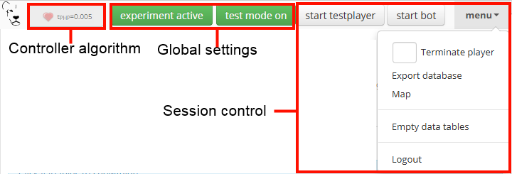

.. _compile_and_test:

====================
Compile and test
====================
Once you are ready specifying your experimental screens, you can test your LIONESS experiment. Here we describe the basic procedures of how test your experiment and make adjustments on the fly. Once you are done testing, you can download your experiment, put it on your own server, and :ref:`run <run>` your experiment online.

Compile your LIONESS experiment
==================================================

In LIONESS Lab, click *compile and test*, and compile your experiment by selecting *compile* from the drop-down menu. During the compilation process, LIONESS Lab activates a script that will build the database underlying your experiment and creates the experimental pages from the stages that you defined in each of the tabs. Once the compilation process has completed, a new tab will open with the :ref:`control panel <control_panel>` of your LIONESS experiment. All further testing can be done from the control panel.

.. image:: _static/Compile.png

In case you want to make any changes to your screens, you can go back to LIONESS Lab. You can use the *Update screens* option from the same drop-down menu. This will create the experimental pages, without re-building the tables. In most cases this means that you can directly view your changes by refreshing the page in the participant's screen, and continue testing. In cases where you added new variables (e.g. by adding a new input element or by using the `` record()`` function in a JavaScript element), you have to re-build the tables and start a new test session.

.. _control_panel:

Control panel
=========================

The :ref:`control panel <control_panel>` allows the experimenter to control the experimental flow (start and stop the experiment), observe the data collection and download the data and payment file. The control panel also triggers the :ref:`central controller algorithm <control_panel__controller_algorithm>`.

**During a session, the control panel of the experiment needs to be open on the experimenter's computer.**

.. image:: _static/Control_panel_0.png
   :alt:  800px

.. _control_panel__global_control:

Global control
---------------------

The horizontal top bar contain basic control functions.

.. _control_panel__controller_algorithm:

Controller algorithm
---------------------------

The controller algorithm is called by the control panel page. Each second, the control panel will run a PHP script on the server performing checks related to the flow of the experiment. This is indicated with the animated heartbeat next to the LIONESS icon. Specifically, the controller algorithm:

- Controls the registration of new participants. Participants automatically receive a unique playerNr upon entering the experimental pages. If the button Game active is switched off, no participant can enter a session, but those that are already in will be able to proceed.
- Regulates grouping. It tracks the number of participants waiting in the lobby, and groups together those that are ready. Various pre-programmed :ref:`grouping procedures <lobby>` are available.
- Regulates group progress. It tracks for each group the number of participants that are ready to proceed to the next period (or a next stage, in case the experiment requires participants to wait for their fellow group mates) and controls their proceeding to the next period
- Handles dropouts. In case a participant has dropped out (that is, the server cannot detect that their are active), the controller algorithm can take action. Upon dropout, you can choose to have the group continue with reduced size, terminate the whole group, or to take no action at all. You can define your :ref:`dropout handling <parameters__dropouthandling>` preferences in the :ref:`parameters table <parameters>` of an experiment.

Global settings
-------------------

.. _control_panel__active_inactive:

Game active / inactive
~~~~~~~~~~~~~~~~~~~~~~~

With the *Game (in)active* button, you can block new participants from entering. When switched to *inactive*, participants will be directed to a page that they cannot participate at this time. You can customize the default text shown in these cases in the experiment's :ref:`parameters table <parameters>`.

.. _control_panel__terminate_player:

Terminate player
~~~~~~~~~~~~~~~~~~~~~~

You can manually remove a participant from a session by entering their value of *playerNr* in the field next to *Terminate player*. This will take that participant to a screen indicating that they can no longer proceed. The software will treat this participant as a *dropout*, that is, the group will proceed according to the :ref:`dropout handling <parameters__dropouthandling>` settings. Note that terminating a participant is a last resort measure.

Export database
~~~~~~~~~~~~~~~~~~~~~~

With this button the database of the experiment is exported as an Excel file. Each of the :ref:`experiment tables <experiment_tables>` will be shown in a separate Excel tab. The :ref:`decisions table <experiment_tables__decisions>` will typically be the most interesting one as it contains the participants' responses in the experiment.

Empty data tables
~~~~~~~~~~~~~~~~~~~~~~

With this button you can empty the tables of the experiment's database. This will not emtpy the :ref:`globals table <experiment_tables__globals>`. Be aware that this cannot be undone. LIONESS Lab does not store old results.

Map
~~~~~~~~~~~~~~~~~~~~~~

By clicking this button, an external program will create a map showing the location of the participants of your session. These locations are based on the participants' IP addresses (which are encrypted upon entrance) and may be not correct. The tool is just to get an overview from where participants are logged in.

Logout
~~~~~~~~~~~

Log out of the experiment. Logging out implies that the controller algorithm is no longer running. Typically you'd want to click this button only after an experimental session is over.

.. _control_panel__test_mode:

Test mode
----------

When developing your experiment, it is often useful to test you experiment by playing as a participant and inspecting the screens. The test mode will allow you to enter multiple times (i.e. control multiple *test players*) from the same browser.

.. image:: _static/Start_testing.png
   :alt:  400px

In the top bar of the Control panel, make sure that the experiment is active. Then, switch on the test mode. Two buttons will appear: *Start testplayer* and *Start bot*.

Once click this button, two more buttons will appear that will allow you to start your experiment as a test player or start a :ref:`bot <bots>` , which will make automated decisions. Bots are particularly useful for is useful for experiments in groups (so you have to control only one test player while the other decisions are generated automatically) in case you want to check whether all data is correctly recorded in the database.

.. _control_panel__test_player:

Testplayers
~~~~~~~~~~~~

When you click *Start testplayer*, a new tab opens in your browser, which takes you to the first stage of your experiment. You can see the screens that a participant in your experiment would see. Multiple testplayers are supported.

.. _bots:

Bots
~~~~~~

In experiments with many stages (or large groups), it can be useful to automate some players, while operating some others as test players. The 'bot' functionality will help you do that. Clicking the button *start bot* will open a new tab with a robot player. With automated JavaScript functions, this *bot* will give random responses to input elements and will try to proceed through your experiment. We write *try* here, because the *bot* is still in beta version and is not yet able to deal with more sophisticated ways to record data with JavaScript functions.

.. _control_panel__monitor:

Monitor
-------------------

In the bottom part of your :ref:`control panel <control_panel>` you can browse the :ref:`tables <experiment_tables>` of your experiment and :ref:`monitor <control_panel__monitor>` the progress of a session. In the :ref:`core table <experiment_tables__core>`, you can keep track of the test players by selecting to view the variables ``playerNr``, ``groupNr``, ``period`` and ``onPage``. Once you have started one or more Testplayers, they should be visible a entries in this table.

During a session, basic information about the entered participants will appear in the *core* table. By clicking the *display options* button, you can choose which variables in this table you want to track. Clicking the buttons with the variable names will make them visible in the page section below. This section will be updated every second. Among the most useful variables are: playerNr, groupNr, period and onPage. The *onPage* variable tracks which page a participant is currently watching. These pages are marked with stars (indicating :ref:`active screen <defining_your_screens__active_screen>`) or dashes (indicating :ref:`waiting screen <defining_your_screens__waiting_screen>`).

.. image:: _static/Control_panel_3.png
   :alt:  800px

In the example above, there are 5 participants in the experiment. Participants 1-4 have just passed the lobby and have been grouped together - the value of groupNr is *1* for each of these participants. They are currently in period 1, on the page *Decision*. Participant 5 is currently on a page called *Instructions* (which in this case comes before the lobby).

One of the key purposes of testing is to check whether participants' responses are recorded correctly, and to verify if any calculations are performed as they should. For this, the :ref:`decisions table <experiment_tables__decisions>` is most useful. For each period, a new row is added to this table for each participant. Values should appear there once they are entered in the participants' screens.

.. _experiment_tables:

Experiment tables
========================

.. _experiment_tables__core:

core
-----------------

The variables in this table form the core of the experiment. These variables regulate the flow of the experiment, and are used by the controller algorithm to detect progress. This table is the most useful table to monitor during an experimental session. It allows you to track the participants' group number, the page that they are currently on (the variable *onPage*) and their current period number. All columns in the table are explained in detail :ref:`here<parameters__predefined_parameters>`

.. _experiment_tables__decisions:

decisions
-----------------

This table stores the data that is generated by the participants. All their responses are stored in this table. For each period, for each participant, one row will be added to this table to store any responses generated in that period. This table also contains the response times (in seconds) for those pages that are visited in a given period.

.. _experiment_tables__globals:

globals
-----------------

This table stores the parameters of the session. These can be manipulated in LIONESS Lab, in the :ref:`parameter tables <Parameters>` of an experiment. In addition, this table contains the :ref:`message texts <parameters__messages>` displayed to participants once they have dropped out of a session, or cannot or cannot participate. These messages can explain to participants the reasons why they dropped out, or why they cannot participate.

.. _experiment_tables__logevents:

logEvents
-----------------

This table documents key events during the experiment, such as participant entry and dropout. Entries are automaticly added by the :ref:`controller algorithm <control_panel__controller_algorithm>`.

.. _experiment_tables__session:

session
-----------------

This table contains session data. Each participant is associated with one row in this table.

Debugging program code
=========================

One of the key purposes of testing your experiment is to check whether all program code works as intended. Find pointers to debug the code in your JavaScript elements in the next section.

.. _javascript__debugging_your_javascript_code:

Debugging your JavaScript code
------------------------------------

Needless to say, it is critical for the functioning experiments that the program code works correctly. The JS editor in LIONESS Lab provides some support in detecting syntax errors, but not all bugs in your code will be automatically detected. These bugs will only surface when you test your experiment.

The JavaScript code of LIONESS experiments is executed in the participants' browsers. In case variables are displayed as *NaN*, or not displayed at all, chances are that your JS code has not been executed correctly. One downside of JavaScript is that the code stops being evaluated after the evaluation process has run into a mistake.

But, don't worry. Many browsers will have built-in solutions to track the error on the page. While testing your experiment as a *Test player*, you can activate these solutions to keep track of any JavaScript errors that might occur.

In Chrome, you can start the Developer Tools, simply by pressing F12 on your keyboard. Your screen will be split, showing the original page, and its underlying code (which you generated with LIONESS Lab). On the top of this *code* section you find a number of tabs (Elements, Console, Sources, ...). The execution of JavaScript can be viewed in the Console tab. In the majority of cases, bugs are easily identified here. Common bugs are spelling mistakes in variables, or mistakes in calling functions.

When you have spotted the mistake on a participant page, you can go back to LIONESS Lab and spot the mistake in the JS code in the corresponding screen. If you make a change, you can press *Compile and test* and then *recompile experiment (keep tables)* to immediately see whether your change has fixed the bug.

In Firefox, a very similar tool is available, called `Firebug <https://addons.mozilla.org/en-US/firefox/addon/firebug/>`__. This is a plugin with a functionality very similar to Chrome's Developer Tools.

Commenting your JavaScript code
------------------------------------

It is always a good idea to add comments to your code. It makes your code transparent to others and can also help you understanding it when you get back to it at a later time. Now, the usual way to add comments to JS code (e.g. for adding clarifications), is by using the double slash "//". Note that not all web servers will interpret this code the same way. This has to do with line breaks surrounding this code. To prevent your code from being corrupted, use "/\* ... \*/", where the any comments go on the placeholder dots.