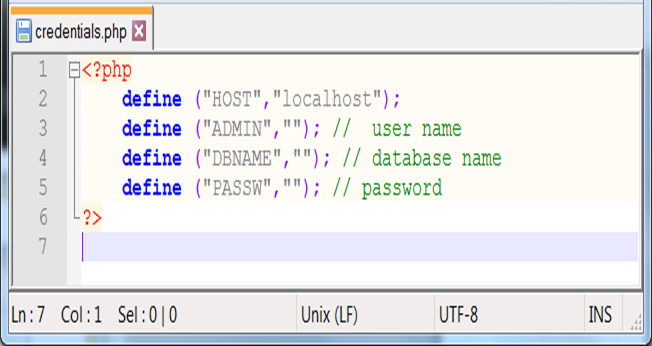
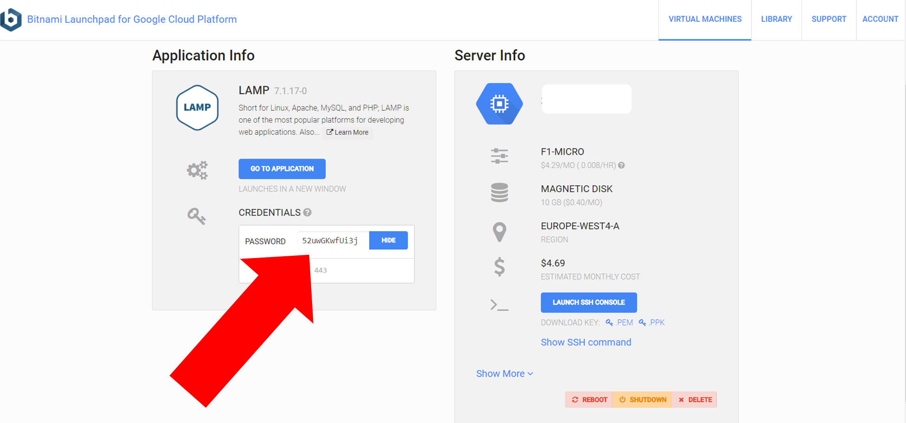
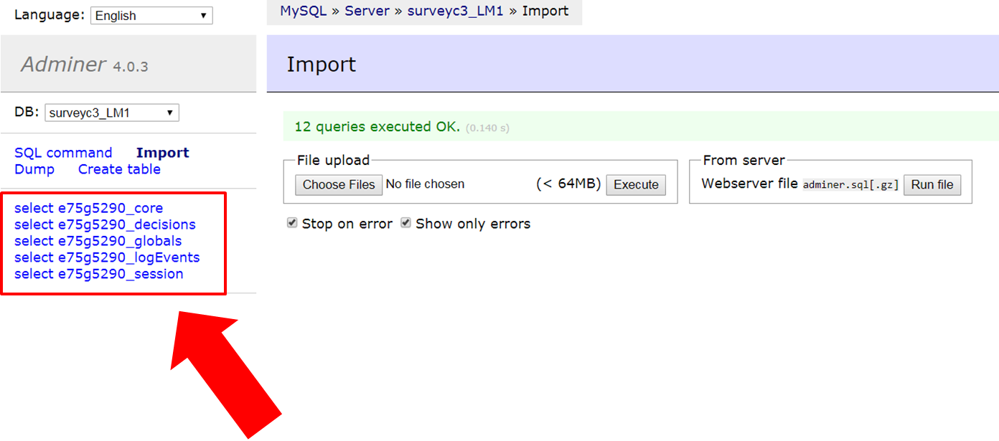

===================================
Set up your own experimental server
===================================

While :ref:`testing <develop>` your experiment, the web pages were on the LIONESS Lab server. This server is for development purposes only. For conducting your online experiment, you need to put your LIONESS experiment on your own server.

Download your experiment
===========================

The first step to copy your LIONESS experiment on your own server, is to download your experiment. In your LIONESS Lab page, click *compile and test* and select *download experiment*.

.. image:: _static/Download_experiment.png
   :alt:  800px

The experimental pages will be downloaded as a .zip file. When you unzip this file, you will see a folder with mainly PHP files. These are the experimental pages (with names stage and wait followed by a number, as well as a number of helper files for e.g. regulating the experimental flow Two files in this folder are of particular importance: credentials.php and sqlCode.sql). These files are for adding the credentials of your own server and setting up the :ref:`tables <experiment_tables>` underlying your experiment. We will get to these two files below.

Adjust your credentials
=========================

In the LIONESS experiment you downloaded from LIONESS Lab, located the file *credentials.php*. In this file you have to set the username and password of your server. You also have to specify the name of the database you intend to use for your experiment (see below).

Set up your server in a few simple steps
=========================================

For running an interactive experiment it is a good idea to use a server with enough computational power to handle many connections and data traffic simultaneously. Such servers are widely available at low cost from different providers (for example `Google cloud <https://cloud.google.com/products/>`__ Google Cloud and `Amazon Web Services <https://aws.amazon.com/>`__ ). Here we describe how to set up your own *virtual server* using Google Cloud' bitnami service. You can use this service to rent a powerful server for the duration of your session, and take the server offline after the session is over. The costs of renting a virtual server for a typical session of around 2 hours will cost you only a tiny fraction of the amounts that participants will usually earn.

If you already have a server running and you know how to operate it, you can skip this section.

Virtual server
---------------

You do not need advanced technical skills to set up a virtual server. Bitnami has a user-friendly point-and-click interface to do this. Here we briefly run you through how to do this. Click here for a more detailed instruction how to set up a :ref:`bitnami server <bitnami>`

(1) Go to the `bitnami <https://google.bitnami.com>`__ website and create a free account.

(2) You receive an email from bitnami to confirm and activate your account.

(3) For your LIONESS experiment, you need to set up a so-called *LAMP stack*, which you can do `here <https://bitnami.com/stack/lamp>`__.

(4) Choose *Launch in the cloud* by clicking the button.

.. _bitnami:

Bitnami
--------

We will use Bitnami to set up a pay-as-you-go server that you can take offline as soon as your session is over. This saves the costs of having a permanent server. As an indication: renting a suitably powerful server for a session of two hours will costs you less than $1 - which is very low compared to the other costs involved (e.g. paying participants).

 1. Go to bitnami.com/stack/lamp and click *Launch in the cloud* and choose the Google Cloud. - On the page *New Virtual Machine*, give your server a name (e.g. *LIONESS server*)

[ go step by step through this setup process ]

 - Connect to your server with [FileZilla]

 2. Set up your LIONESS Lab task on your server

 - Download your task by choosing Compile and test --> Download game - Extract the ZIP file

 - Go to the folder *htdocs* on your server and create a folder with the name of your task (e.g. PGG). Note that this name will be part of the web address that your participants will visit, so you might want to use a non-descriptive name (e.g. PGG, or task).

 - Upload the task to the folder *htdocs* on your server.

 3. Prepare your HIT on MTurk

 copy text from http://surveycamel.com/hively/drafts/LIONESS/mturk-session/

4. Launch your HIT, monitor the progress and pay the participants the random code - a shorter version of http://research-tricks.blogspot.de/2012/07/bulk-bonuses-on-mturk.html\

Upload your LIONESS experiment to your server
===============================================

Now your server has been set up, you can upload your LIONESS experiment to your server. To transfer the experiment to your server, you have to install an *FTP application*. A decent (and free) option is `FileZilla <https://filezilla-project.org/>`__. Choose the FileZilla Client. When installing, stick to the default options.

Once FileZilla is installed, choose File... and then Site manager.

The screenshot below illustrates the settings you need: choose *New site* and add the IP address of the virtual server in the Host field.
You can find this IP address in bitnami. For Protocol, choose *SFTP-SSH*.

.. image:: _static/FileZilla_sm.png
   :alt:  350px

Once you are logged in, create a new folder for your experiment (e.g. *PGG*). Copy all LIONESS files into that folder.

Set up your database and LIONESS tables
-----------------------------------------

On your server, log into your MySQL administrator environment (e.g. phpMyAdmin or adminer). The below example assumes you use adminer.php, but for phpMyAdmin it works very similarly.

Create a new database by clicking Create new database on the top of the page. Give it the name of your experiment and save (e.g. *myExperiment*). **The database name needs to correspond to the database name you set in *credentials.php* (see above)**.

In *credentials.php*, the HOST should be set to *localhost*, and the ADMIN to *root*. The DBNAME should correspond to the database you just created (e.g. *myExperiment*). The PASSW (password) should match that of the server you created. You can find this password in the bitnami launchpad.

Set up the tables by clicking Import and select the file sqlCode.sql

After selecting this file, click the Execute button to define the structure of the database. This structure ensures that the data produced by the participants in the experiment will be saved in the appropriate place. If all went well, you should now see the the following tables in your database: core, decisions, globals, logEvents, and session.

Your experiment is now ready to run. You can go to the ControlPanel through the address http://%5Byour server name]/[your experiment name]/_beginControl.php (so, for example http://myServer/myExperiment/_beginControl.php).