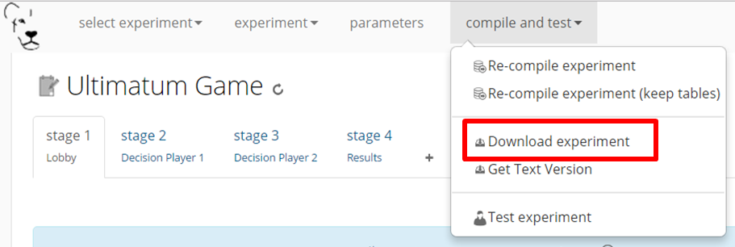
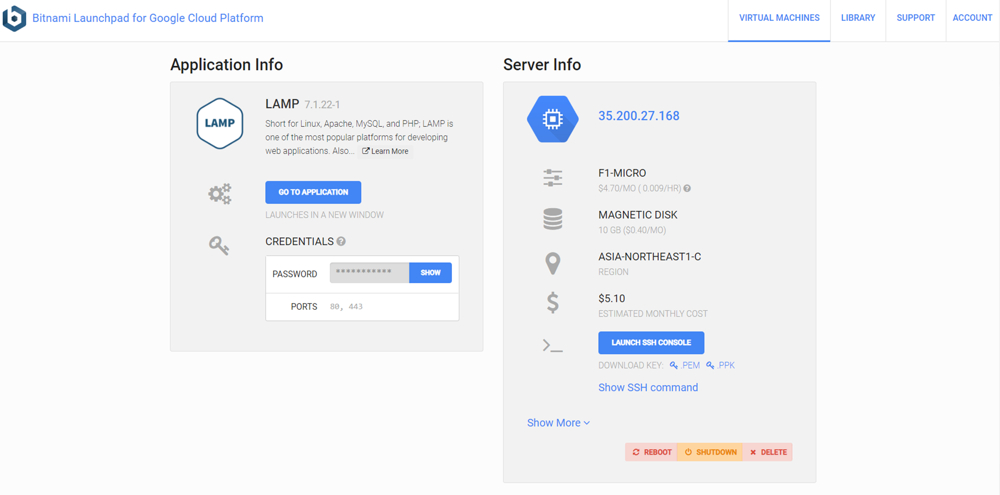
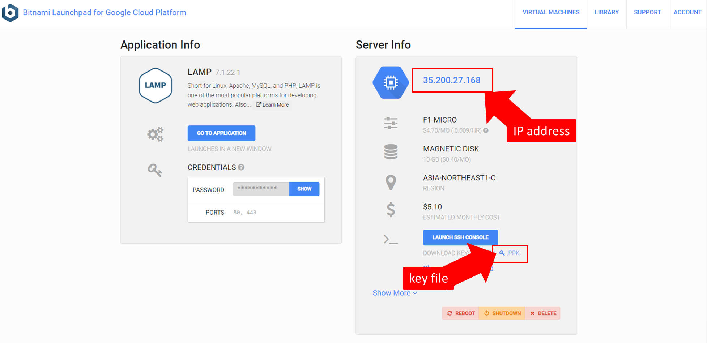
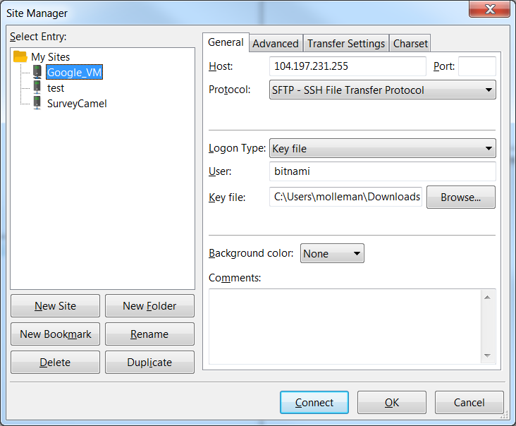

===================================
Set up your own experimental server
===================================

While :ref:`testing <develop>` your experiment, the web pages you navigated were on the LIONESS Lab server. This server is for development purposes only. For conducting your online experiment, you need to put your LIONESS experiment on your own server.

Download your experiment
===========================

The first step to copy your LIONESS experiment on your own server, is to download your experiment. In your LIONESS Lab page, click *compile and test* and select *download experiment*.

The experimental pages will be downloaded as a .zip file. When you unzip this file, you will see a folder with mainly PHP files. These are the experimental pages (with names stage and wait followed by a number), as well as a number of helper files for e.g. regulating the experimental flow. For running a LIONESS experiment, you will have to upload these files to your own server.

Set up your server in a few simple steps
=========================================

For running an interactive experiment it is a good idea to use a server with enough computational power to handle many connections and data traffic simultaneously. Such servers are widely available at low cost from different providers (for example `Google cloud <https://cloud.google.com/products/>`__ Google Cloud and `Amazon Web Services <https://aws.amazon.com/>`__ ). Here we describe how to set up your own *virtual server* in Google Cloud using the Bitnami service. Bitnami helps you to set up a virtual server and install all necessary programs with only a few clicks. You can use this service to rent a powerful server for the duration of your session. In our experience with previous LIONESS experiments, Bitnami's *small* server suffices for smoothly running experimental sessions with up to 500 participants. A *small* server by default consists of 1 CPU and 1.7 GB RAM. That said, server requirements can vary with experimental design (e.g. amount of code or media files added by the user), so as a general rule, it is better to stay on the safe side and rent a relatively powerful server. After a session is over you take the server offline. The costs of renting a virtual server for a typical session of around 2 hours will cost you only a tiny fraction (typically less than $1.00) of the amounts that participants will usually earn.

.. note:: If you already have a server running and you know how to operate it, you can skip the next section.

.. _bitnami:

Virtual server
---------------

You do not need advanced technical skills to set up a virtual server. Bitnami has a user-friendly point-and-click interface to do this. Here we briefly run you through how to set up your server with Bitnami in the Google Cloud.

(1) Go to the `bitnami <https://google.bitnami.com>`__ website and create a free account.

(2) You receive an email from bitnami to confirm and activate your account.

(3) For your LIONESS experiment, you need to set up a so-called *LAMP stack*, which you can do `here <https://bitnami.com/stack/lamp>`__.

(4) Choose *Launch in the cloud* by clicking the button.

(5) To start a Virtual Machine, you need to start a *project* in your *cloud account*. A menu will guide you through some basic settings in the *developer console*. This will enable a few features essential for a server to run on the machine (like the *application programming interface* (API), and billing details). The brief instructions on the Bitnami website make this a straightforward process.

(6) When you return to your *New Virtual Machine* page, you can pick your machine specifications (see above for pointers about what to choose).

(7) On the right hand side there's a map where you can choose the location of your server. For optimal performance, choose something near the location of your prospective participants (e.g. for an MTurk session with US participants, choose a US server). Note that the hourly rates (in $) might slightly vary between locations.

(8) Click *create* and your server is live! A *launchpad* will open, which shows some details of your server (e.g. its IP address).

(9) Check your server by entering the IP address in a browser.

Upload your LIONESS experiment to your server
===============================================

Now your server has been set up, you can upload your LIONESS experiment to your server. To transfer the experiment to your server, you have to install an *FTP application*. A decent (and free) option is `FileZilla <https://filezilla-project.org/>`__. Choose the FileZilla Client. When installing, stick to the default options.

Once FileZilla is installed, choose *File…* in the top horizontal menu, and then *Site manager*.

For the dialog box that pops up, the screenshot below illustrates the settings you need: choose *New site* and add the IP address of the virtual server in the Host field. You can find this IP address in the bitnami launchpad as shown in the screenshot below. For Protocol, choose *SFTP-SSH*.

.. _bitnami_launchpad:

Enter ``bitnami`` as User, and a *Key file* as Logon type. You can download this key file from the Launchpad. In FileZilla, find this file by using *Browse…*. Clicking *Connect* at the bottom should give you access to the server.

FileZilla will show you the contents of your local machine (typically on the left hand side) and the contents of the server you just connected to (right hand side). On the server, locate the folder ``htdocs``. This is the folder from which the experimental pages will be served.

Enter the folder ``htdocs`` and create a subfolder with the name of your experiment (e.g. PGG). Note that this name will be part of the web address that your participants will visit, so you might want to use a non-descriptive name (e.g. PGG or task). Copy the whole LIONESS experiment from your local machine into that subfolder.

For an easy setup LIONESS needs to be able to write the server credentials to a file. To allow that, find the file ``credentials.php`` in the folder of your experiment. In FileZilla Right-click on this file, and select *File permissions...*. A dialog box will open. Make sure that the *Read* and *Write* boxes are checked for *Public permissions*. If not check them and save the changes.

You can go to the :ref:`control panel <control_panel>` through the address ``http://[your server name]/[your experiment name]/controlpanel.php`` (so, for example ``http://101.248.10.293/PGG/controlpanel.php``). To find your server's IP address, see :ref:`Bitnami Launchpad <bitnami_launchpad>`).

Upon first entrance, you will be prompted to enter the server credentials, so that your LIONESS experiment can interact with the server. By default, LIONESS experiments enter the most common values, but you will have to add the server password. This, again, can be found in the :ref:`Bitnami Launchpad <bitnami_launchpad>`.

Your experiment is now ready to run. 
