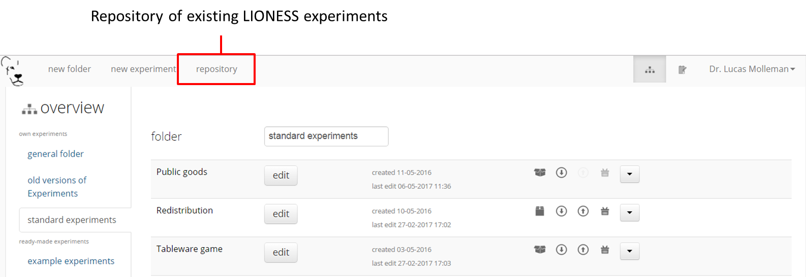
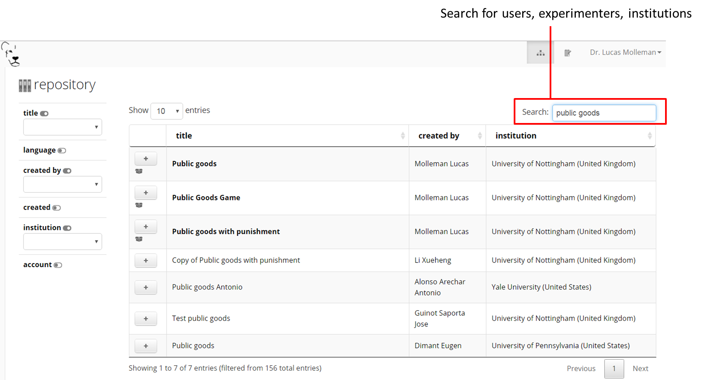
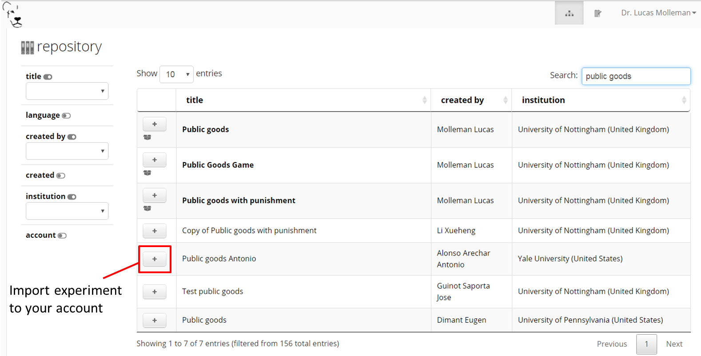

.. _share:

=========================
Share with others
=========================

LIONESS Lab encourages its users to share their experiments once they are ready. Experiments can be shared through the :ref:`repository<repository>` or via a link. By sharing your experiments, you can contribute to the number of experimental designs that are available for others to build on.

Sharing your experiments is important for a number of reasons. A large set of usable and customisable designs facilitates the easy development of experiments, and helps avoiding that experimenters are re-inventing the wheel by programming from scratch their own solutions to common issues. Moreover it promotes reproducibility of experimental methods and results.

.. note:: You can only share your own games via link or repository.

Sharing with a link
====================

If you want to share your experiment with one specific user, you can click on the sharing symbol in the overview of games. Then a link is created that can be shared with another user. The other has to be logged in before pasting the sharing link. 

.. _repository:

Repository
==========

The Repository allow you to browse the experiments of other LIONESS Lab users and import them to your own account. You can then view the experiment, test it, copy it to your account and customise it as you wish. By making your own experiments *public* (see below), other users may also import your experiment to their accounts and adjust it to meet their own requirements.

The Repository aims to facilitate easy development of experiments, avoid that experimenters are re-inventing the wheel by programming from scratch their own solutions to common issues, and to promote reproducibility of experimental methods and results.

Using the repository
---------------------

You can access the Repository of LIONESS Lab experiments from the landing page.

You can search for experiments by using the field on the top right.

In case you with to view an experiment, you can simply import it to your account by clicking on the *+* sign. The system will take you right to your own account, and the newly imported experiment will be ready for viewing. Note that you cannot make any changes until you have made a copy of the imported experiment in your own account.

Making your experiment available in the repository
------------------------------------------------------

When you have made your experiment *public* in the experiment settings page, your experiment will be visible to others in the Repository. You can always change the settings for an experiment by adjusting this setting in the *experiment settings*.

And then make your choice from the dropdown menu.
