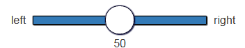

=========================
Reference manual
=========================


Experimental Flow
==================

In LIONESS Lab you can create LIONESS experiments. These experiments include a set of standard features enabling online interactive experiments. Here we describe these features.

.. note:: This section provides an overview of the structure and functioning of LIONESS experiments. Implementation issues are discussed in :ref:`the develop section <develop>`.

The following figure shows the flow of a typical LIONESS experiment.

1. Participants enter the experiment via a web link from an external website (e.g. Amazon MTurk), and are registered on the server (that is, they receive a 'player number', a unique number to identify them during the experiment).
2. They complete the experiment by navigating the pages :ref:`click here for a typical experimental design, including tips and tricks <notes_experimental_design>`.
3. At the end they return to the external site to collect their earnings (euro sign).

.. image:: _static/control_flow2.png

The blue arrows show the typical experimental flow. The red arrows show exceptions to the typical flow (most notably, dropouts) and the mechanisms in place that deal with those exceptions. The blue line around the experimental stages mark the boundaries of a LIONESS experiment.

When participants enter the experiment, they are registered and get a unique player number. Then they go to the first stage of the experiment (typically instructions). This is a :ref:`standard stage <stage_type__standard>` that provides information to participants. After that, an optional :ref:`quiz <quiz>` may follow in which participants have to answer control questions to ensure understanding. After passing the quiz, participants wait in the :ref:`lobby <lobby>` to be matched to a group. The lobby is a key stage of an interactive experiment. It is not needed for solo tasks. Once they are matched in a group, participants make their decisions and receive feedback (possibly over several rounds). Once they completed the interactions rounds, they are informed about their payoffs.  From there they are directed back to the external site (e.g. MTurk) to collect their payment.

While participants complete the experiment, various exceptions might happen. Below we list how LIONESS experiments handle these issues.

.. note:: Upon dropout participants receive different standard messages, which can be customized in the parameters. For all list of all messages see also :ref:`here <parameters__predefined_parameters>`. All messages refer to the terminology HIT which is a task on Amazon MTurk.

.. note:: LIONESS experiments do their best to prevent double participation by IP address check and cookies in the browser. Some of these measures can still be circumvented with some effort. If you want to be 100% sure that participants only participate once they should be provided with a ticket or unique ID which they have to enter during the experiment.

a) Internet Explorer
---------------------

LIONESS experiments (like many other modern web applications) do not support Internet Explorer (IE). Experimenters can announce this upon recruitment (e.g. in their MTurk HIT). In case an IE user attempts to enter the experiment, they are directed to a page explaining that they cannot participate. By default, this message reads:

.. warning:: As indicated in our HIT text on MTurk, our HIT does **not** support Microsoft Internet Explorer.                         Please return this HIT. We apologise for any inconvenience caused.

Participants can return using a different browser.

.. note:: All default messages assume participants are recruited from Amazon MTurk. You can edit these message in the parameter table, for example when you recruit your participants from elsewhere (e.g. Prolific),

b) Task not active
-------------------

Experimenters can set the experiment 'inactive' or 'active' in the control panel. If the task is inactive, new participants cannot enter and receive the following default message:

.. warning:: This HIT is currently offline. You cannot participate at this time.

When an experiment is switched to 'inactive' in the middle of a session (for example, when an experimenter realizes that something is wrong), participants who are already in the experiment can continue and complete the experiment.


c) Double login
----------------

LIONESS experiments record the IP addresses of participant in an *anonymized* way to protect personal data. With the anyonimized IP addresses it can be checked if two participants log in from the same IP address. The actual IP address cannot be retrieved.

If a login attempt is made from the same IP address, the participant is blocked and receives the following message:

.. warning:: According to our records, your device has already been connected to the server during this session.                Participants are only allowed to enter a session once. Thank you for your understanding.

This IP address check is **deactivated** whent the [LINK-->test mode<---LINK] is on.

.. note:: If you think that your participants may use the same IP address (which may be common in a laboratory setup) you may switch to test mode. Otherwise participants cannot enter the experiment.

d) Session full
----------------

In the :ref:`experiment parameters <parameters__totalPlayers>`, you can set the total number of players allowed into your session. When this number has been reached, further participants cannot enter anymore. They receive the message:

.. warning:: We have sufficient participants for this HIT. Unfortunately, you cannot participate at this time. Thank you for your understanding.

This functionality is **deactivated** when the :ref:`test mode <control_panel__test_mode>` is on.

.. note:: When a participant tries to enter an experiment, the current number of participants is compared to the total number of players allowed. The current participants also include those who started the experiment but dropped out (see f), g), i), j) and k)). It is therefore often useful to set the :ref:`total players <parameters__totalPlayers>` higher than the number of participants you actually need.

e) Not registered
-------------------

Participants can only enter a LIONESS experiment through the registration page. Navigating to a stage somewhere in the middle of an experiment without being registered leads to a page reading:

.. warning:: You are currently not logged in. You cannot participate in the HIT.


f) Time out
-------------

In each stage, you can define a maximum time participants have to complete the stage. This is useful to keep up the pace of the experiment (avoiding long waiting times, which risk droupouts). If a participant does not respond in time, they can be directed towards a different stage in the experiment, or to the standard time out page which shows the following message:

.. warning:: You did not make a decision before the time was up. You have been removed from the HIT. You can close down this window.

g) Kicked out by experimenter
-------------------------------

In the control panel (top-right menu), experimenters can remove participants by entering their player number and click 'terminate player'. They receive the following message and get their show-up fee:

.. warning:: Unfortunately, this HIT was terminated for a technical reason! You cannot continue. You will receive your guaranteed participation fee of $ $participationFee$. To collect your earnings, please fill out this random code on MTurk:
                **$randomid$** Once you have filled out this code, you can close this window.
                Thank you for your participation.


.. note:: the values between $ signs are filled by the values set in the :ref:`test mode <parameters>`. Terminating participants should, of course, be done with care. This feature is intended for cases in which technical problems occur.

h) No re-entering possible
---------------------------

If participants try to re-enter after being removed from the experiment, they are informed that they cannot participate in the experiment anymore.

.. warning:: You are currently not logged in. You cannot participate in the HIT.

.. note:: This information that a participant has been kicked out is based on the IP address (if the test mode is switched off) and a cookie in the browser. If the participant uses a different browser from a different IP address he or she can still enter as a new participant.

i) Too many quiz errors
-------------------------

In the quiz stage, the experimenter can specify a maximum number of quiz failures. It the participant fails more than that, he is excluded from the experiment and receives the following message:

.. warning:: You did not answer the quiz correctly and were excluded from further participation.

j) No group match
------------------

In the lobby, participants wait until they are matched. You can set the maximum waiting time. If there is no other participant within that time, the participant is directed to a page where they can choose to wait an additional two minutes or to leave the experiment. In the latter case the participant is directed to a page (set by the experimenter) where they would typically be informed that they receive the guaranteed participation fee.

k) Group aborted
------------------

The experimenter can choose how their LIONESS experiment :ref:`handle dropouts <parameters__dropouthandling>`. In particular, it is important to define what happens to the other participants if one drops out. The default option in LIONESS experiment is *continue with reduced group*, so that the other group members can finish the experiment, avoiding participant disappointment and potential reputation damage on the part of the experimenter. The settings for dropout handling can be found in the :ref:`handle dropouts <parameters__dropouthandling>`.

If  *terminate group* is selected as the dropout handling option, all players of the group are removed from the experiment and receive the following message:

.. warning:: Unfortunately, one of the players in your group dropped out of the HIT! You cannot continue. You will receive your guaranteed participation fee of $ $participationFee$. To collect your earnings, please fill out this random code on MTurk: **$randomid$** Once you have filled out this code, you can close this window. Thank you for your participation.

.. _stage_type:

Stage type
=========================

There are three different types of stages, the names of which are largely self-explanatory.

.. _stage_type__standard:

Standard
--------

Standard stages are the most commonly used types. In this stage types, all :ref:`elements` are available to use. This stage type is typically used for instructions, screens that require responses, and feedback screens.

.. _quiz:

Quiz
----

Quiz stages have the same functionality available as Standard stages, but there is one feature on top of that. For Quiz stages, LIONESS documents the number of attempts a participant needs to proceed. Typically, input :ref:`elements` in quiz stages will have the field *correct value* defined. The variable *quizFail* in the :ref:`session table <experiment_tables__session>` tracks the total number of attempts a participant has made.  For each player, it both stores the total and by-item number of mistakes.

.. _lobby:

Lobby
-----

In lobby stages, participants are matched in groups. The matching procedure is defined *globally* in the :ref:`parameter table <parameters>`. In case no elements are defined in a lobby stage, a default text will be shown, along with an auto-updated message indicating how many other participants are currently needed to form a group. This message gives the participants an idea how long they will have to wait before their interactive task starts (see example below).

.. image:: _static/Lobby.png
   :alt:  500px


.. important:: LIONESS experiments currently only support one lobby.


.. _matching_procedures:

Matching procedures
-------------------

Once sufficiently many participants are in the lobby a group can be formed. Experimenters can choose 3 types of matching:

:First come, first serve: As soon as sufficiently many participants are in the lobby, a group will be formed.

Before the lobby, experimenters can assign different *roles* to players (using the variable *role* in the :ref:`core table <experiment_tables__core>`). The other two available types of matching make use of this variable 'role' to form groups.

:Groups with unique roles: As soon as at least 1 participant with each role 1...n is present (where n is the group size), a group will be formed.

:Group with the same role: Groups are formed of participants with the *same* role. This is useful when you have different treatments in the same session, and participants from the same treatment need to be grouped together.

.. _stage_and_element__countdown_timer:

Countdown timer
~~~~~~~~~~~~~~~
In interactive tasks, it is often useful to set timers on decisions to keep up the pace of the experiment. Countdown timers prompt participants to give responses within a set time, and reduces the waiting time for their group mates, which in turn reduces inattention and dropouts.

.. image:: _static/Timeoutpic.png
   :alt:  500px

To add a timer to a participant screen, click the *timer* switch on the top of the stage. Set the time (in seconds) that participants can take to submit their response. If the option *leave stage after timeout* is switched off, nothing will happen once the timer reaches 0. If this option is switched on, you are prompted to define the stage to which non-responsive participants are directed to. You can choose a stage that you defined yourself, or choose the *standard* timeout page. This page will show the participants the :ref:`message <parameters__messages>` that is specified in the :ref:`parameters table <parameters>`. You can also choose to direct non-responsive participants to the waiting screen of the current stage. In that case, make sure that the experiment can continue, e.g. by filling out a default response by the participant so that results can be calculated.

.. note:: If you automatically direct all participants to a stage on timeout, they may arrive at different times at the next page (due to different internet speed). They are not directed to a waiting screen in this case. Therefore, you should add another stage where buttons click a continue button and then "wait for others" on the waiting page. This guarantees that synchronisation is done correctly.

Note that in :ref:`JavaScript <elements__javascript_program>` , the number of seconds in the countdown timer can be manipulated with the variable *TimeOut*. This is useful if you want to give participants more time in early rounds. The below example illustrates this.

.. code-block:: javascript

   if (period < 3){
     TimeOut=120;
	}


.. _main_menu:


.. _elements:

Elements
=========================

.. _adding_an_element:

Adding an element
-----------------
You can add a new element to a stage by clicking on the drop-down menu *add new element.*

.. image:: _static/Add_new_element.png
   :alt:  600px

Once you have clicked on the element type of your choice, you paste it by clicking on the 'paste' button.

.. image:: _static/Paste_element.png
   :alt:  600px


Generic properties of elements
------------------------------

Move element
~~~~~~~~~~~~~

move up

.. image:: _static/Up.png
   :alt:  30px

move down

.. image:: _static/Down.png
   :alt:  30px

display condition
~~~~~~~~~~~~~~~~~~~~~~~~~~

.. image:: _static/Display_condition.png
   :alt:  30px

For each display element, you can use the JS variables defined above it (as well as global variables) to specify display conditions. These conditions are evaluated in JavaScript directly. This means that setting display conditions for elements, you do not need the dollar signs to refer to variables.

JavaScript elements do not have display conditions. Display items generated by JS (written to the participant screen with, e.g., `document.write()` ) will be placed at the position of the JS element.

For example, if you want to display a text box in period 1 only, you can define its display condition as follows:


Copy element
~~~~~~~~~~~~~

.. image:: _static/Copy.png
   :alt:  30px

Cut element
~~~~~~~~~~~~~

.. image:: _static/Cut.png
   :alt:  30px

Delete element
~~~~~~~~~~~~~~~~~~~~~~~~~~

.. image:: _static/Delete.png
   :alt:  30px

Element types
-------------

.. _elements__text_box:

Textbox
~~~~~~~

Here is an example of how textbox element looks like:

.. image:: _static/Exampletext1.png
   :alt: exampletext1.png

This text box element will show the following text to the participants.

.. image:: _static/Exampletext2.png
   :alt: exampletext2.png
   :width: 180pt

In the textbox element, you can insert text, such as the description of your experiment. When you double click the area inside the text box, a user friendly WYSIWYG editor will appear.

.. image:: _static/Textboxdoubleclick.png
   :alt: textboxdoubleclick.png

In this interface you can adjust text fonts and colour, but you can also use standard HTML. You can toggle between WYSIWYG and HTML view by double clicking in the editor. By clicking the ``< >`` sign you can toggle back and edit the HTML directly.

.. image:: _static/Textbox_gui.png
   :alt: textbox_gui.png

.. _elements__button:

Button
~~~~~~

.. image:: _static/Button.png
   :alt: button.png

The Button element mainly functions as a trigger to move on to the next desired stage. There are six sub elements in the Button element. They are like the following:

:Button label:
    You can define the name of the button which will appear to the participant, in this case *continue.*

:Proceed:
    In the *proceed* element, you can define whether pressing the button automatically leads to the next desired page or wait until all other participants press the button so that all participants can continue simultaneously. For the former case you can select *if possible,* and for the latter case you can select *Wait for others.*
    
.. note:: All buttons on one stage should all have the same setting: all *Wait for others.* or all *if possible*. If you mix the two options, some players A wait for players B of their group which already have proceded (due to players B having *if possible*). Players A will then never be pushed forward.  

:Appears after:
    If you would like to set a restriction that participants can proceed only after some amount of time, then you can define after how many seconds will the participants be able to proceed to the next stage. If you wish not to use this function, then you can just leave it as it is.

:Button countdown:
    If this is activated, then a countdown is shown until the button appears.

:Next stage:
   In this menu, you can define onto which stage the experiment proceed. Default is it will proceed to the next stage so you can just leave it as it is if this is the case, but you can also define it to jump to another page. Jumping to another page is useful when you want to skip certain pages in the middle.

:Checker:
   If you want to execute JavaScript code when a participant clicks a button, you can use the checker element. One useful application of this option is checking whether two values in two separate input fields add up to a certain value, for example:

   .. code-block:: javascript

      if (value1+value2 != 10) {
         showError('The total number should be 10!');
         return false;
         }


.. _elements__javascript_program:

JavaScript program
~~~~~~~~~~~~~~~~~~

JavaScript programs allow you to interact with the server and do calculations. A set of pre~defined :ref:`functions <javascript__interacting_with_the_database>` is available to get variables from the database and to write data to the database tables. When you start defining your JavaScript element, LIONESS Lab will open an editor.

.. image:: _static/Javascript_program.png
   :alt: javascript_program.png

By default, JavaScript programs will be executed in the participants' browsers when the page loads. One exception to this is the checker functionality in :ref:`button <elements__button>` elements, which is executed once the button is clicked.

Note that JavaScript elements allow for great flexibility. For example, with a bit of programming experience you can add design your own display items (e.g. in an SVG canvas), add interactive elements to your page revealing information upon mouse~click, or animate items in your screen. We have a few :ref:`examples <javascript_code_snippets>` available.

Also note that JavaScript is a language widely used by web programmers. The large user base ensures that you will be able to solve the vast majority of your programming issues with a simple Google search.

JavaScript programs are limited to 500 lines.

.. _numeric_input:

Numeric input
~~~~~~~~~~~~~

An example of using numeric input element in an experiment is like the following.

.. image:: _static/Numeric_input.png
   :alt: numeric_input.png


This content will show the following screen to participants.

.. image:: _static/Example_numericInput.png
   :alt: example_numericInput.png


In this element, you can collect participant's responses in numbers.

.. image:: _static/Numeric.png
   :alt: numeric.png


:Text:
   You can set the question to which the participants will be answering.

:Variable name:
   You can set the name of the variable of the numeric input. This will be handy later on when you have to use the participant's answers in Javascript or for analysis.

:Minimum:
   You can define the minimum value which participants can enter. If this condition is not met, a warning message will appear to the participants.

:Maximum:
   This is the maximum value the participants can enter. Like minimum, when participants enter a value which exceeds this value, then a warning sign will appear.

:Decimal place:

:Correct value:
   Optionally, you can set a correct value for the participants' answer. If the participant's response does not match this value, a warning sign will appear and participants will not be able to proceed to the next stage.

:Required:
   If you activate this element, then the participants will be able to proceed only if this input field is answered.

:Inline:
   Display the input field next to the text.

Radio line
~~~~~~~~~~

An example of the radioline produced by this element looks like this:

.. image:: _static/Radioline_example.png
   :alt: radioline_example.png


In this element, you can make a scale on which the participants can choose their discrete numerical answer.

Adding a radio line element prompts you to define the following:

.. image:: _static/Radioline1.png
   :alt: radioline1.png

:Text above:
   Define the question to which the participants will answer. It will be located where *radioline* is in the example.


:Variable name:
   You can set the name of the variable of the numeric input. This will be handy later on when you have to use the participant's answers in Javascript or for analysis.


:Minimum:
   The minimum value is the value of the leftmost option of the radioline. However, the absolute value of the minimum option does not appear to the participants. Subtracting maximum value by minimum value determines how many dots (options) there are between minimum and maximum value.


:Maximum:
   The maximum value is the value of the rightmost option of the radioline. However, the absolute value of the maximum option does not appear to the participants. Subtracting maximum value by minimum value determines how many dots (options) there are between minimum and maximum value.

:Label left:
   You can assign a name for the lowest value on the radio line. For example, if you were to indicate in a scale of 1 to 7 about liking, then usually the value on the left is most negative.

:Label right:
   You can assign a name for the highest value on the radio line. For example, if you were to indicate in a scale of 1 to 7 about liking, then usually the value on the right is most positive.


:Required:
   If you activate this element, then the participants will be able to proceed only if this input field is answered.


:Correct value:
   Optionally, you can set a correct value for the participants* answer. If the participant's response does not match this value, a warning sign will appear and participants will not be able to proceed to the next stage.

Slider
~~~~~~




This is an example of how a slider element looks like to the participants.

In this element, you can make a slider on which participants can indicate their discrete numerical answer by sliding the button onto a certain location in the slider. It is basically same as radio line.

.. image:: _static/Slider.png
   :alt: Slider.png


:Variable name:
   You can set the name of the variable of the numeric input. This will be handy later on when you have to use the participant's answers in Javascript or for analysis.


:Minimum:
   The minimum value is the value of the leftmost option of the slider. However, the absolute value of the minimum option does not appear to the participants. Subtracting maximum value by minimum value determines how many dots (options) there are between minimum and maximum value.


:Maximum:
   The maximum value is the value of the rightmost option of the slider. However, the absolute value of the maximum option does not appear to the participants. Subtracting maximum value by minimum value determines how many dots (options) there are between minimum and maximum value.

:Stepsize:
   This indicates the unit which the button can be incremented or decremented along the slider. For example, if the stepsize is big, then the distance among possible locations of the button will be also larger.

:Default:
   The starting position of the slider. This is the value that the slider takes when it is not moved by the participant.


:Label left:
   You can assign a name for the lowest value on the slider. For example, if you were to indicate in a scale of 1 to 7 about liking, then usually the value on the left is most negative.


:Label right:
   You can assign a name for the highest value on the slider. For example, if you were to indicate in a scale of 1 to 7 about liking, then usually the value on the right is most positive.


:Correct value:
   Optionally, you can set a correct value for the participants' answer. If the participant's response does not match this value, a warning sign will appear and participants will not be able to proceed to the next stage.

.. _discrete_choice:

Discrete choice
~~~~~~~~~~~~~~~

.. image:: _static/ExampleDiscreteChoice.png
   :alt: ExampleDiscreteChoice.png


This is an example of a discrete choice element shown to the participants.

Discrete choice element is basically just like a multiple~choice question. Participants can choose their answers among the given options.

.. image:: _static/Discrete_choice.png
   :alt: discrete_choice.png


:Text above:
   You can set the question to which the participants will be answering.


:Variable name:
   You can set the name of the variable of the discrete choice the participants will make.

:Required:
   If you activate this element, then the participants will be able to proceed only if this input field is answered.


:Inline:
   Display the input field next to the text.

:Order of options:
   There are two ways of presenting options - one is *as stated* and one is *random.* In the former case, the order of options will appear exactly how the experimenter arranged the order, and for the latter the order of options will be random for each subject.

:Display of options:
   There are three ways to display options - vertical boxes, horizontal boxes, and dropdown list.


:Correct value:
   Optionally, you can set a correct value for the participants' answer. If the participant's response does not match this value, a warning sign will appear and participants will not be able to proceed to the next stage.


:Default:

:Num options:
   Here, you can define among how many discrete choices the participants can make their choice.

:Options:
   You can write the name of the options which will be appeared to the participants. Also, presenting images instead of text is possible by providing a link: ````. Beware that the image should be uploaded on another open access website. The 'value' for each options will be recorded to the database, and can be used for later analysis or Javascript program.

Reference
~~~~~~~~~~~~~~~~
.. image:: _static/Element_reference.png
     :alt: element_reference.png

Here, you can refer to a previously created element. When you change the original element, the element reference will change along with it. You can only refer to an element from your current experiment.

Text input
~~~~~~~~~~

.. image:: _static/ExampleTextInput.png
   :alt: ExampleTextInput.png


This is an example of a text input element shown in the actual experiment.


:Variable name:
   You can set the name of the variable of the numeric input. This will be handy later on when you have to use the participant's answers in Javascript or for analysis.

:Minimum characters:
   Optionally, you can define minimum number of characters the participants should enter in this input field before proceeding to the next stage.

:Maximum characters:
   Optionally, you can define maximum number of characters the participants can enter in this input field.

:Number of rows:
   The vertical size of the box (the number of lines that is displayed).

:Required:
   If you activate this element, then the participants will be able to proceed only if this input field is answered.

Back button
~~~~~~~~~~~

.. image:: _static/Backbutton.png
   :alt: Backbutton.png


:Button label:
   You can define the name of the button which will appear to the participant, in this case *back*.

:Back to:
   In this menu, you can define onto which stage the experiment will go back. The default setting is it will go back to the stage right before so you can just leave it as it is if this is the case. You can also define it to jump to another page.


.. _javascript:


JavaScript
=========================

LIONESS experiments use JavaScript to do calculations and to interact with the :ref:`database <experiment_tables>` `JavaScript <http://www.w3schools.com/js/default.asp>`__ (JS) is a widely used language for web programming. JS is executed in the browser of the participants (so, not on the server).

JavaScript code can be added to any stage of your LIONESS experiment through a :ref:`JavaScript element <elements__javascript_program>`.

.. _javascript__access_the_variables:

.. warning:: If you use comments in your code, you should always use `/*` comment `*/` instead of `//` comment. Some browsers (Safari) may misinterpreted commenting out single lines with `//`.

Access JS variables
------------------------------------

Values of JS variables can be accessed in other elements (e.g. a text box) by adding dollar signs on both sides of the variable name (e.g. `$contribution$`).

.. _standard_variables:

Default variables
------------------

When a participant's page loads, all variables defined in the :ref:`parameters table <parameters>` are loaded. This is also true for the
following default variables from the :ref:`core table <experiment_tables__core>`. This means that these variables are defined (i.e. have a value) in every screen and their values are accessible in JS.

================= ================================
Variable name     Details
================= ================================
playerNr          Number of the focal player within the session
groupNr           Group number of the focal player
subjectNr         Player number of the focal player within group
period            Period number of the focal player within session
tStart            System time in seconds upon page load
currentGroupSize
role
bot
randomid
================= ================================


.. _javascript__interacting_with_the_database:

Interacting with the database
------------------------------------

Variables specified in input elements' (numeric input, choice buttons, etc) will be automatically stored in the table *decisions*.

JavaScript elements allow you to read from and write to the database, using the below functions. Note that each function has a *simple* and a *full* version. The simple versions always assume that the function pertains to the current player, the current group, and the current period. In the below examples, the simple and full versions are equivalent.


Writing to the database
-----------------------

You can directly write to the :ref:`decisions table <experiment_tables__decisions>`  of the experiment's database, using the following functions. Note that, for database management reasons, it is currently not possible to create new variables in the database using *for loops* or *while loops*. Italic function parameters are optional.

:Function: setValue()

   :Arguments: *table name, condition,* variable name

   :Simple example: setValue('payoffThisPeriod');

   :Full example: setValue('decisions', 'playerNr='+playerNr+' and period='+period, 'payoffThisPeriod');


:Function: record()

   :Arguments: variable name, value

   :Simple example: record('PGGshare', publicGoodShare);


:Function: setBonus()

   :Arguments: amount

   :Simple example: setBonus(payoff);


The function `record()` will create a variable in the decisions table with the name of the first argument and the value of the second argument. In the example above, the decisions table would have one column with the name 'PGGshare', the value of which would equal the value of the JavaScript variable 'publicGoodShare'.

The function `setBonus()` will write the value in its argument to the variable `bonusAmount` in the 'sessions' table. It will also update the variable `totalEarnings` in that table to the sum of `bonusAmount` and `participationFee`.

**The value argument cannot contain any operators, such as the + or the - sign.**

Reading from the database
-------------------------
Italic function parameters are optional.

:Function: getValue()

   :Arguments: *table name, condition,* variable name

   :Return value: one element

   :Simple example: getValue('someVariable');

   :Full example: getValue('decisions', 'playerNr='+playerNr+' and period='+period, 'someVariable');


:Function: getValues()

   :Arguments: *table name, condition,* variable name

   :Return value: array

   :Simple example: getValues('someVariable');

   :Full example: getValues('decisions', 'playerNr='+playerNr+' and period='+period, 'someVariable');


There are special functions for retrieving the values from others in your group, in the current period.

:Function: getValuesOthers()

   :Arguments: variable name

   :Return value: array starting from 0 ordered by subjectNr

   :Simple example: getValuesOthers('someVariable');


.. _javascript_code_snippets:

JavaScript code snippets
-------------------------


.. _parameters:

Parameters
==========
The parameters of your LIONESS experiment are set in this menu. Your settings are stored in the globals table. In each participant screen, the parameters defined here are available through JavaScript. The variable names are exactly as described here.

The menu contains three tabs: :ref:`predefined parameters<parameters__predefined_parameters>`, :ref:`messages<parameters__messages>` and :ref:`custom parameters<parameters__own_parameters>`.


.. _parameters__predefined_parameters:

Predefined parameters
---------------------

.. image:: _static/Parameter_table.png
   :alt:  300px

active
~~~~~~

This parameter regulates whether the experiment is active, and is set in the :ref:`control panel <control_panel>`. When the experiment is *active*, the value of this parameter is 1, otherwise it is 0. Participants can only enter active experiments.

testMode
~~~~~~~~~~~~~~

This parameter regulates the :ref:`test mode <control_panel__test_mode>`, and is set in the :ref:`control panel <control_panel>`. In the test mode, multiple participants can be operated from the same browser, using different tabs. This is useful when developing your LIONESS experiment. TestMode can be set in the :ref:`Control panel <control_panel>` and should not been changed here.

.. _parameters__totalPlayers:

totalPlayers
~~~~~~~~~~~~~~

This parameter sets a *cap* on the total number of participants allowed to enter an experimental setting. In test mode the cap is removed. When a participant tries to enter a session after this number has been reached, they will be redirected to a screen displaying a :ref:`message1 <parameters__messages>` indicating that the current session is full.

.. _parameters__groupSize:

groupSize
~~~~~~~~~~~~~~

This parameter defines the size of the groups. Once the number of participants waiting in the lobby equals this number, the :ref:`controller algorithm <control_panel__controller_algorithm>` will match them into a group and pushes them to the next stage. Typically, this next stage will be thefirst stage of a period (see :ref:`loopStart <parameters__loopstart>`).

.. _parameters__numberperiods:

numberPeriods
~~~~~~~~~~~~~~

This parameter defines the total number of periods in the experiment. Periods start with the stage defined in :ref:`loopStart <parameters__loopstart>` and end with :ref:`loopEnd <parameters__loopend>`).

.. _parameters__loopstart:

loopStart
~~~~~~~~~~~~~~

The parameter defines which stage is the first stage of a period. When a group reaches the stage define in :ref:`loopEnd <parameters__loopend>`, all participants in that group will be directed here, if the period number has not reached the value set in :ref:`numberPeriods <parameters__numberPeriods>`.


.. _parameters__loopend:

loopEnd
~~~~~~~~~~~~~~

This parameter defines which stage is the last stage of a period. When a group reaches this stage, the period number of this group will be increased with 1, and all members will be redirected to the stage defined in :ref:`loopStart <parameters__loopstart>`. When the period number has reached :ref:`numberPeriods <parameters__numberPeriods>`, the group will proceed to the stage defined right next to this stage. Note that in the last stage of a period, participants will typically have to wait for all of their group mates to finish the period, that is, they have to *wait for all* before they can proceed.

.. _parameters__participationfee:

participationFee
~~~~~~~~~~~~~~~~~~~~~~~~~~~~

This parameter sets the guaranteed participation fee, which participants will receive independently of their performance in the experiment.

exchangeRate
~~~~~~~~~~~~~~

The exchange rate can be used to convert experimental points into real money.

.. _parameters__dropouthandling:

dropoutHandling
~~~~~~~~~~~~~~~~

This parameter defines how dropouts should be handled. Participants who dropped out (e.g. by failing to respond within the set time) will be directed to a screen displaying a :ref:`message <parameters__messages>` indicating that their session is over. From the menu, you can choose from three options defining how to deal with the other group members.

:terminate group: If one participant drops out, the other participants in their group will be led to a screen displaying a :ref:`message <parameters__messages>` indicating that one of the group mates has dropped out and that the session is over. When you choose this option, consider taking measures to compensate these group mates as they might expect to earn some more in the periods they will not be able to complete due to this dropout.


:proceed with reduced group: This is the default setting. Once a participant drops out, the other group members continue with a group reduced in size. The variable *currentGroupSize* in the :ref:`core table <experiment_tables__core>` will be reduced with 1. When you choose this option, consider adding a warning message (using JavaScript) to the other participants. Also, keep in mind that in many cases, the data generated by groups reduced in size requires special treatment in analyses.


:disable exclusion: This option is best used for individual (non-interactive) tasks, or when you deploy LIONESS in the laboratory (that is, not with participants recruited online), where dropouts are atypical. When a participant loses connection to the server (e.g. due to network problems), you can try to solve this without the participant dropping out. The other members of the group typically wait and continue once the problem is solved.

sortableMatching
~~~~~~~~~~~~~~~~~~

This defines how the participants in the lobby are matched in groups. There are two options to choose from.

:first come, first serve: This is the default option. As soon as the number of participants in the lobby equals :ref:`groupSize <parameters__groupsize>` they are matched and can start interacting. This setting aims to minimize waiting time.

:match groups with unique roles: In some cases you might want to allocate roles before you assign participants to groups. Before participants enter the lobby, they can be assigned a role (by setting their variable *role* in the :ref:`core table <experiment_tables__core>`. Roles need to start with 1, and run up to value value of the groupSize. For example, if you have groups of 3, a group will be formed as soon as a set of players with roles 1, 2 and 3 can be formed.

.. _parameters__messages:

Messages
---------

Each experiment contains a page with messages tell participants that their session has terminated prematurely. These messages are necessary for clear communication with participants upon dropouts, and to provide information as to why they cannot proceed with the session. Each of the messages has a default text, which can be edited in the messages tab. Messages are displayed conditional upon the event that triggered the termination (see below). You can find more information when a certain event is triggered in the :ref:`experimental flow <experimental_flow>` section.

.. image:: _static/Parameter_table_messages.png
   :alt:  300px

:message0: The experiment is currently not active (see :ref:`active <control_panel__active_inactive>`).

:message1: A participant tries to connect to the server while they are already connected.

:message2: The maximum number of participants for this session has already been reached.

:message3: The participant is not connected to the server.

:message4: The participant has been :ref:`manually removed <control_panel__terminate_player>` from the session.

:message5: The participant did not make a decision within the set time. They are removed from the session.

:message6: The participant's group has been terminated due to a dropout of a fellow group mate. This is only used when the :ref:`dropout handling <parameters__dropouthandling>` has been set to *terminate group*.

:message7: The participant tries to enter a session using Internet Explorer. This browser is not supported.

:message8: The participant has not successfully completed the control questions after the set number of attempts. They cannot continue.

.. _parameters__own_parameters:

Custom parameters
------------------

.. image:: _static/Parameter_table_addOwn.png
   :alt:  300px


You can add your own parameters by clicking the *+* sign. In the left hand side field you can give the variable a name, and in the right hand side field you can set its value. Only numerical values are supported. The parameter will be available for JavaScript in all the participant stages. You can delete your parameters by clicking the bin icon.

