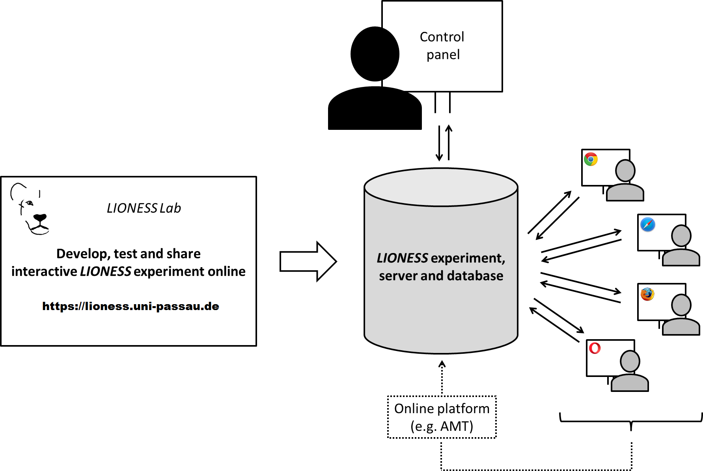

.. Read the Docs Template documentation master file, created by
   sphinx-quickstart on Tue Aug 26 14:19:49 2014.
   You can adapt this file completely to your liking, but it should at least
   contain the root `toctree` directive.

==================================================
Welcome to the LIONESS Lab documentation!
==================================================

LIONESS Lab is a free web-based platform for online interactive experiments. LIONESS experiments include standardized methods to deal with group formation, handling participant dropout and other challenges of online interactive experiments.

With LIONESS Lab you can readily develop and test your LIONESS experiments online in an user-friendly environment. You can develop experiments from scratch in a point-and-click fashion or start from an existent design from our growing repository and adjust it according your own requirements. A what-you-see-is-what-you-get interface allows you to easily define participant screens. You can use JavaScript for any programming - e.g. to calculate payoffs or manipulate variables. You can use a range of ready-made functions to get data from (and write to) the server.

Once your LIONESS experiment is ready, you can download it and run it on your own server. Participants can then invited to online sessions via online labor markets or crowding websites, e.g. by using Amazon Mechanical Turk (MTurk). At the end of a session, you can download a spreadsheet with the data, as well as a file to automate bonus payments on MTurk. Using LIONESS Lab you can choose to share LIONESS experiments with your co-authors and other experimenters.

.. _architecture:

Architecture
=================

With LIONESS Lab, you can develop interactive online experiments in a point-and-click fashion. LIONESS experiments regulate the information flow between participants. Before a session, the experimenter uploads the LIONESS experiment to the server. In a typical online experiment participants log in to the server via a link posted on a crowd-sourcing website (e.g. `Amazon Mechanical Turk <http://www.mturk.com>` or `Prolific academic <https://prolific.ac/>`). Participants interact through their web browsers and receive a code to collect their payment upon completion. Throughout the session, the :ref:`control panel <control_panel>` displays the participants' progress in the experiment.

Standardized methods
=======================

LIONESS experiments provide a set of standarized methods for group formation, attrition and other challenges of interactive online experiments. This is extensively discussed in a `this <https://link.springer.com/article/10.1007/s10683-017-9527-2>`__ paper by Arechar et al.

Table of content
==========================

.. toctree::
   :maxdepth: 10
   :glob:

   010_basic
   030_detailed_instructions
   040_reference_manual
   050_further_details

