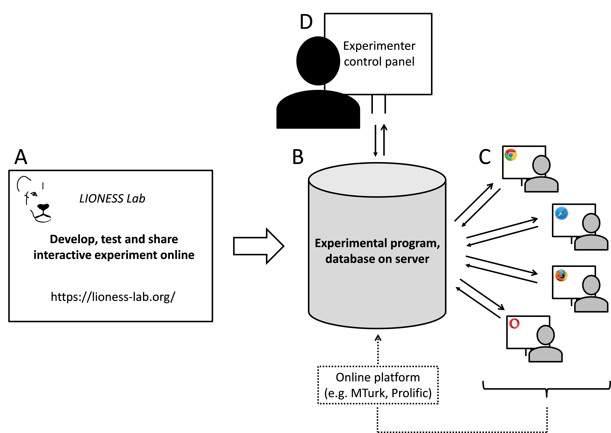

==================================================
Welcome to the LIONESS Lab documentation!
==================================================

LIONESS Lab is a free web-based platform for online interactive experiments. LIONESS experiments include standardized methods to deal with group formation, handling participant dropout and other challenges of online interactive experiments.

With LIONESS Lab you can readily develop and test your LIONESS experiments online in an user-friendly environment. You can develop experiments from scratch in a point-and-click fashion or start from an existent design from our growing repository and adjust it according your own requirements. A what-you-see-is-what-you-get interface allows you to easily define screens. You can use JavaScript for any programming - e.g. to calculate payoffs or manipulate variables. You can use a range of ready-made functions to get data from (and write to) the server. This way, researchers using LIONESS Lab require little programming skills. At the same time, users with more advanced programming skills can use JavaScript to flexibly add a wide range of functionalities to their experiments.

Once your LIONESS experiment is ready, you can download it and run it on your own server. Participants can then invited to online sessions, e.g. by using Amazon Mechanical Turk (MTurk). At the end of a session, you can download a spreadsheet with the data, as well as a file to automate bonus payments on MTurk. Using LIONESS Lab you can choose to share LIONESS experiments with your co-authors and other experimenters.

.. _architecture:

LIONESS experiments regulate the information flow between participants. Before a session, the experimenter uploads the LIONESS experiment to the server. In a typical online experiment participants log in to the server via a link posted on a crowd-sourcing website (e.g. `Amazon Mechanical Turk <http://www.mturk.com>`__ or `Prolific <https://prolific.ac/>`__). Participants interact through their web browsers and receive a code to collect their payment upon completion. Throughout the session, the :ref:`control panel <control_panel>` displays the participants' progress in the experiment.

LIONESS experiments provide a set of standarized methods for group formation, attrition and other challenges of interactive online experiments. This is extensively discussed in a `paper by Arechar et al. <https://link.springer.com/article/10.1007/s10683-017-9527-2>`__

Online experiments: challenges and solutions
-------------------------------------------------------

Conducting experiments online presents a set of methodological and logistical challenges not present in the traditional decision making laboratory. LIONESS experiments have built-in features that deal with these challenges. The most important one is driving down dropouts.

In online experiments, participants may drop out. Typically they complete their experiment from home, and can get distracted (especially when waiting on others), have a bad internet connection or may just leaving a session by closing the experimental pages. This will lead to missing data. Moreover, in interactive experiments, dropouts can also affect other participants (e.g. group mates). LIONESS experiments help avoid dropouts with measures reducing waiting times.

Timers can be added to decision pages, keeping up the pace of decision making in a group. Experimenters can choose to remove unresponsive participants from the experiment and let the others proceed. Furthermore, groups can be formed on-the-fly. Participants often do not enter experimental sessions exactly at the same time, and they will vary in the time they take to read instructions (and complete control questions). Groups can be started as soon as sufficient participants are ready to start making decisions.

Should dropouts occur, standard procedures are in place to adequately deal with that. Experimenters can choose to allow participants to complete the experiment if one (or more) of their group mates have dropped out. This prevents disappointment for participants (in case they wouldn't be able to complete the experiment and might earn less than they expected), and, related, negative online reviews potentially damaging the experimenter's reputation.

.. note:: While LIONESS Lab has been specifically designed to accommodate *interactive* experiments, it can also be used for solo-tasks and non-interactive questionnaire studies.

.. note:: You can also download this documentation as a PDF_. Please note that we update the documentation so please check for new version of the documentation from time to time.

.. _PDF: https://readthedocs.org/projects/lioness-doc/downloads/pdf/latest/

.. _user-docs:

.. toctree::
   :maxdepth: 2
   :caption: User Documentation

   self
   010_basic
   0301_develop
   0302_compile_and_test
   0303_set_up
   0304_run
   0306_share
   0305_notes
   040_reference_manual
   050_further_details
   999_go_back

